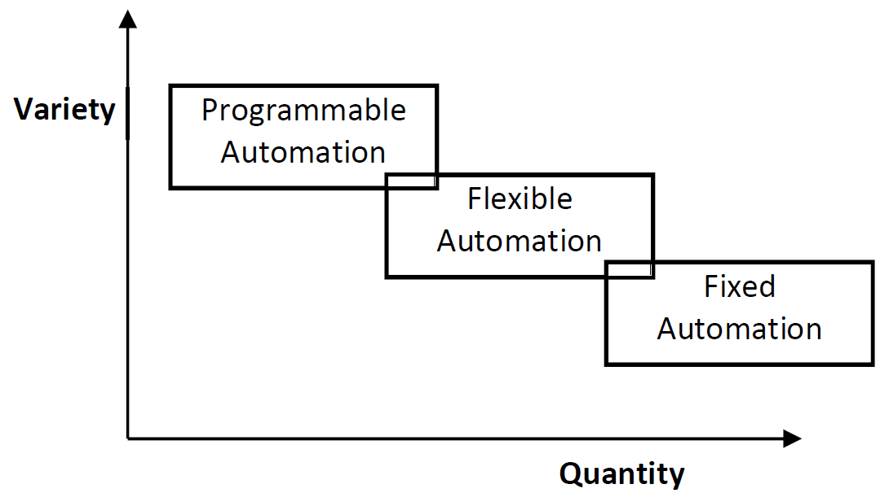
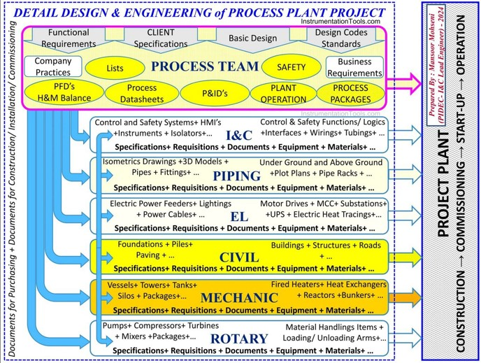

# Process and Design

------------------------------------------------------------------------

<details>

<summary>What is manufacturing process engineering?</summary>

Process engineering is a specialized branch of engineering that focuses on the optimization of complex production processes, as well as the design, analysis, and implementation of manufacturing systems.

</details>

<details>

<summary>What is the role of automation in various manufacturing processes?</summary>

With the push for Just-In-Time (JIT) manufacturing and the importance of reaching higher productivity and efficiency levels, automation in manufacturing is paramount.

</details>

<details>

<summary>What are advantages of automation in manufacturing?</summary>

-   Lowered Operating Costs
-   Improved Worker Safety
-   Reduced Factory Lead Times
-   Increased Production Output
-   Smaller Environmental Footprint
-   Increased Productivity and Efficiency
-   Increased System Versatility

</details>

<details>

<summary>What are disadvantages of automation in manufacturing?</summary>

-   Higher Start-up cost and the cost of operation.
-   Higher Cost of Maintenance.
-   Obsolescence/Depreciation Cost.
-   Unemployment.
-   Not economically justifiable for small scale production.

</details>

## Types of automation in various manufacturing processes

-   Fixed automation – *large volume, single part productions*\
    Fixed automation is a system in which the sequence of processing (or assembly) operations is fixed by the equipment configuration. Each of the operations is the sequence is usually simple, involving perhaps a plain linear or rotational motion or an uncomplicated combination of the two; for example, the feeding of a rotating spindle

-   Programmable automation – *associated with batch production*\
    In programmable automation, the production equipment is designed with the capability to change the sequence of operations to accommodate different product configuration. The operation sequence is controlled by a program, which is a set of instructions coded so that they can be read and interpreted by the system. New programs can be prepared and entered into the equipment to produce new products

-   Flexible automation – *Real time, on-demand production*\
    Flexible automation is an extension of programmable automation. A flexible automated system is capable of producing a variety of parts (or products) with virtually no time lost for changeovers from one part style to the next. There is no lost production time while reprogramming the system and altering the physical setup (tooling, fixtures, machine settings). Consequently, the system can produce various combinations and schedules of parts or products instead of requiring that they be made in batches.

```{r, echo=FALSE, out.width="50%", fig.align="center", fig.cap="Flowchart illustrating different types of manufacturing processes"}

```

<details>

<summary>List in which industries you can find various automated process systems</summary>

- Refineries,
- Chemical plants
- Food processing facilities
- Textile production mills
- Waste water treatment plants
- Automated material handling systems
- Breweries
- Automotive industries
- Pharmaceutical industries
- Defense industries
- Mining industries

</details>

## Flow of process engineering- design to commissioning 

```{=html}
<div style="position: relative; padding-bottom: 56.25%; height: 0; overflow: hidden; max-width: 100%;">
  <iframe 
    style="position: absolute; top: 0; left: 0; width: 100%; height: 100%;"
    src="https://www.youtube.com/embed/BzPTGWKLP7c" 
    title="YouTube video player" 
    frameborder="0" 
    allow="accelerometer; autoplay; clipboard-write; encrypted-media; gyroscope; picture-in-picture; web-share" 
    referrerpolicy="strict-origin-when-cross-origin" 
    allowfullscreen>
  </iframe>
</div>
```
```{r, echo=FALSE, out.width="50%", fig.align="center", fig.cap="Flowchart illustrating different types of manufacturing processes"}

```

## FEL/FEED (Front End Engineering Design) 
```{=html}
<div style="position: relative; padding-bottom: 56.25%; height: 0; overflow: hidden; max-width: 100%;">
  <iframe 
    style="position: absolute; top: 0; left: 0; width: 100%; height: 100%;"
    src="https://www.youtube.com/embed/gSkoGFLDxF0" 
    title="YouTube video player" 
    frameborder="0" 
    allow="accelerometer; autoplay; clipboard-write; encrypted-media; gyroscope; picture-in-picture; web-share" 
    referrerpolicy="strict-origin-when-cross-origin" 
    allowfullscreen>
  </iframe>
</div>
```
- Project Organization Chart
- Project Scope
  - Defined civil, mechanical, and chemical engineering
  - HAZOP, safety and ergonomic studies
  - 2D & 3D preliminary models
  - Equipment layout and installation plan
  - Engineering design package development
  - Major equipment list
  - Automation strategy
- Process Flow Diagrams (PFD) and Piping and Instrumentation Diagrams (P&ID)
- Project timeline
- Fixed-bid quote


<details>
<summary>What are the steps of Process System Design and Engineering </summary>

- Develop PFDs & P&IDs
- Process simulation
- 2D & 3D models,
- Equipment layout and installation plan
- Skid design
- Mechanical & structural design
- Piping design,
- Lifts & installation planning,
- Process instrumentation design

</details>


<details>
<summary>Automation and Controls Engineering</summary>

- Automation design
- Control panel fabrication
- Controls Integration services
- SCADA design
- Safety engineering
- Programming – PLC, DCS, HMI,...

</details>

<details>
<summary>Process Equipment Fabrication and Assembly</summary>

- Sheet metal fabrication
- Skid frame fabrication
- Mechanical assembly
- Painting
- Pressure vessel fabrication
- Structural fabrication
- Electrical panel fabrication
- Electrical wiring
- Instrumentation installation
- Insulation
- Painting
- Pipe fitting
- Tooling
- Tubing
- Welding
- ...

</details>

<details>
<summary>Testing & Commissioning</summary>

- Factory Acceptance Tests
- Processing plant commissioning/ Site Acceptance Tests

</details>
