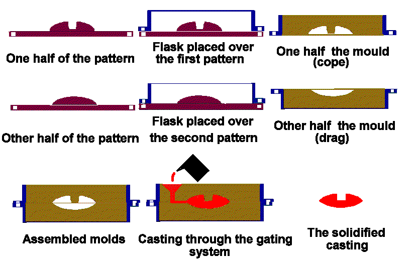
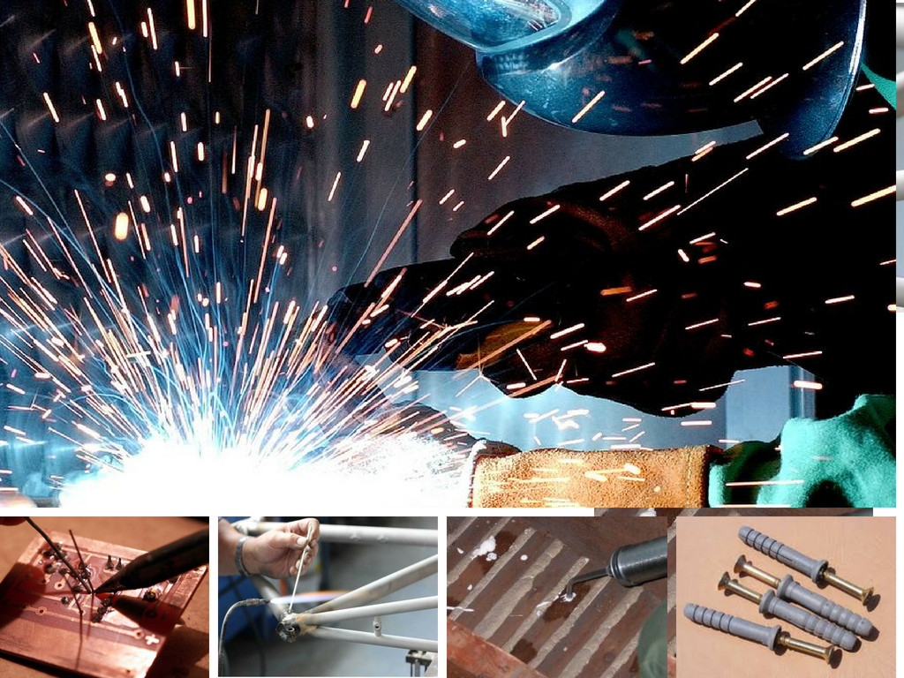
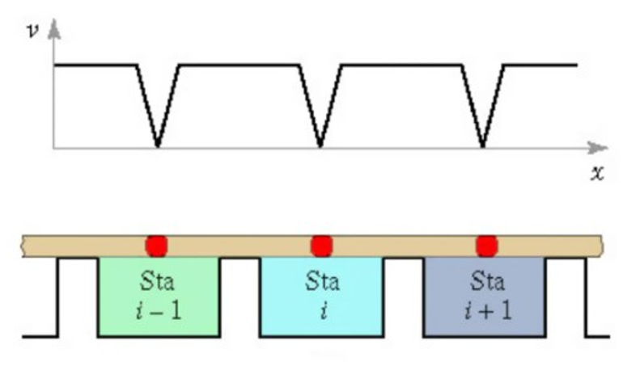
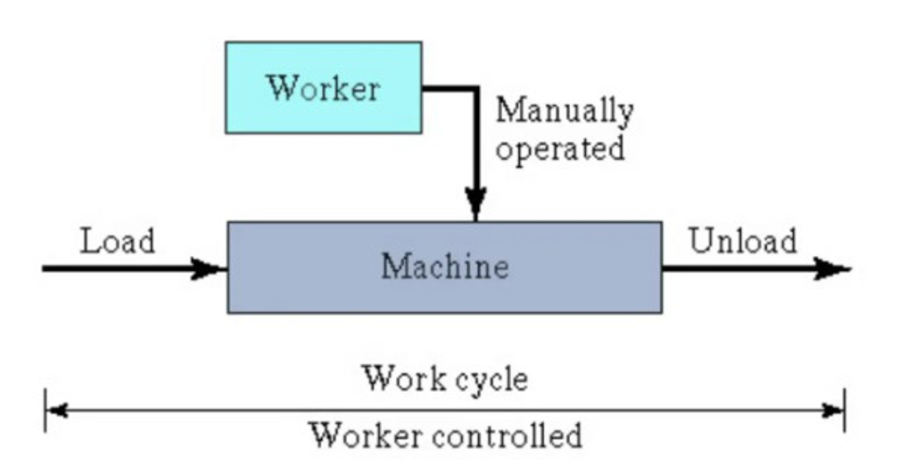
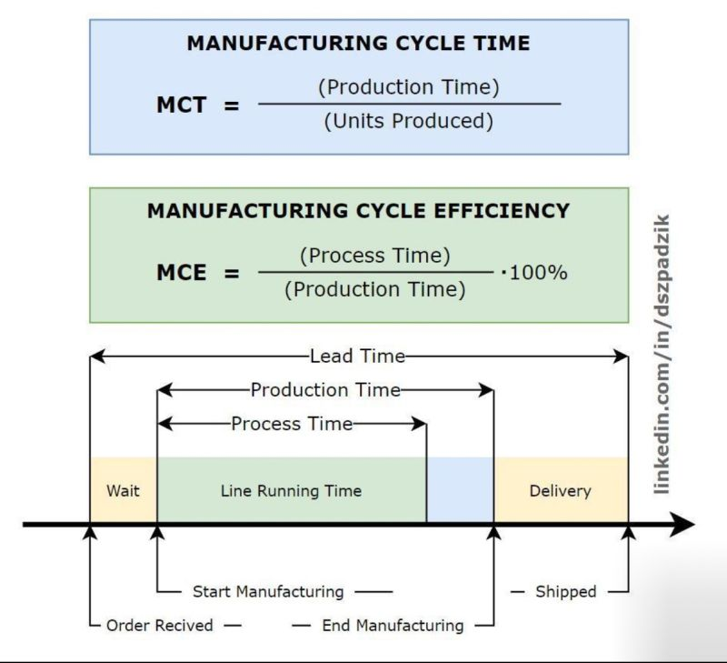

--- 
title: "ENGR-3027 Process Engineering"
author: "Martin Volkening"
date: "`r Sys.Date()`"
site: bookdown::bookdown_site
documentclass: book
bibliography: [references.bib]
url: https://prof-mv.github.io/ENGR-3027/
# cover-image: path to the social sharing image like images/cover.jpg
description: |
  Lecture notes accompanying the course.
link-citations: yes
github-repo: Prof-MV/ENGR-3027
---

# Introduction {-}

Why are we studying this?

  *	Defining and identifying manufacturing processes is critical to understanding the role that automation plays and how to program an industrial process line.
  * What are some examples of a manufacturing process?
  *	What do we have or use that is manufactured?
  *	What is the biggest manufacturing change that you have experienced so far?

  *	Processes have changed throughout the centuries and have been driven by the four Industrial Revolutions.
  
  *	First Industrial Revolution – Coal in 1765
    * This transformed society from an agricultural base to an industrial base. Processes became mechanized and rather than hand made, products were manufactured. The discovery of coal and the development of the steam engine and metal forging transformed the way goods were created.
    
  * Second Industrial Revolution – Gas in 1870
    *The discovery of oil and electricity fueled the second industrial revolution. The discovery of oil lead to the invention of the combustion engine and new steel and chemical based products entered the manufacturing streams. Technological advances in communication were driven by the invention of the telegraph and later the telephone. Modes of transportation developed with the invention of the airplane and automobile. These discoveries helped to drive the advent of mass production which forever changed how items were produced.
    
  * Third Industrial Revolution – Electronics and Nuclear Energy in 1969
    *The third industrial revolution is dominated by the development of electronics and the beginning of the age of computers.
    *Technological developments were centered around four pillars of science: telecommunications, biotechnology, information technology and energy engineering.
    
  *	Fourth Industrial Revolution – Internet and AI
    * The fourth industrial revolution describes the current era of digitalization, automation, and advanced manufacturing technology. It's characterized by the convergence of emerging technologies, such as robotics, the Internet of Things (IoT), and 3D printing.
    
Check out these videos:
    
<iframe width="560" height="315" src="https://www.youtube.com/embed/kpW9JcWxKq0" frameborder="0" allowfullscreen></iframe>
    
and 

<iframe width="560" height="315" src="https://www.youtube.com/embed/okXk4Bnz2Lc" frameborder="0" allowfullscreen></iframe>
    
What is a Fifth Industrial Revolution going to look like? 

<iframe width="560" height="315" src="https://www.youtube.com/embed/sGI2FFm_8tw" frameborder="0" allow="accelerometer; autoplay; clipboard-write; encrypted-media; gyroscope; picture-in-picture" allowfullscreen></iframe>


Further Reading
[Whitepaper 'What is Manufacturing' by Intel](https://www.intel.com/content/www/us/en/newsroom/tech101/manufacturing-101-what-is-manufacturing.html#gs.hgplkf)

| Category                  | Grade Item                  | Type                  | Max. Points | Weight (%) |
|---------------------------|-----------------------------|-----------------------|-------------|------------|
| **Lab-Tutorial**          | **Lab-Tutorial**            | **Association**       | **48**      | **40**     |
| **Labs**                  | Lab-1                       | NumericSubmissions    | 48.33       | 8.33       |
|                           | Lab-2                       | NumericSubmissions    | 48.33       | 8.33       |
|                           | Lab-3                       | NumericSubmissions    | 48.33       | 8.33       |
|                           | Lab-4                       | NumericSubmissions    | 48.33       | 8.33       |
|                           | Lab-5                       | NumericSubmissions    | 48.33       | 8.33       |
|                           | Lab-6                       | NumericSubmissions    | 48.33       | 8.33       |
|                           | Lab-7                       | NumericSubmissions    | 48.33       | 8.33       |
|                           | Lab-8                       | NumericSubmissions    | 48.33       | 8.33       |
|                           | Lab-9                       | NumericSubmissions    | 48.33       | 8.33       |
|                           | Lab-10                      | NumericSubmissions    | 48.33       | 8.33       |
|                           | Lab-11                      | NumericSubmissions    | 48.33       | 8.33       |
|                           | Lab-12                      | NumericSubmissions    | 48.33       | 8.33       |
| **Assignments**           | **Assignments**             |                       | **12**      | **12**     |
|                           | Assignment-1                | NumericQuizzes        | 2           | 16.67      |
|                           | Assignment-2                | NumericQuizzes        | 2           | 16.67      |
|                           | Assignment-3                | NumericQuizzes        | 2           | 16.67      |
|                           | Assignment-4                | NumericQuizzes        | 2           | 16.67      |
|                           | Assignment-5                | NumericQuizzes        | 2           | 16.66      |
|                           | Assignment-6                | NumericQuizzes        | 2           | 16.66      |
| **Lab Pop-up Quizzes**    | **Lab Quizes**              |                       | **3**       | **3**      |
|                           | Lab Quiz-1                  | NumericQuizzes        | 0.5         | 16.66      |
|                           | Lab Quiz-2                  | NumericQuizzes        | 0.5         | 16.66      |
|                           | Lab Quiz-3                  | NumericQuizzes        | 0.5         | 16.67      |
|                           | Lab Quiz-4                  | NumericQuizzes        | 0.5         | 16.67      |
|                           | Lab Quiz-5                  | NumericQuizzes        | 0.5         | 16.67      |
|                           | Lab Quiz-6                  | NumericQuizzes        | 0.5         | 16.67      |
| **Lecture Pop-up Quizzes**| **Lecture Quizes**          |                       | **3**       | **3 **     |
|                           | Lecture Quiz-1              | NumericQuizzes        | 0.5         | 16.66      |
|                           | Lecture Quiz-2              | NumericQuizzes        | 0.5         | 16.66      |
|                           | Lecture Quiz-3              | NumericQuizzes        | 0.5         | 16.67      |
|                           | Lecture Quiz-4              | NumericQuizzes        | 0.5         | 16.67      |
|                           | Lecture Quiz-5              | NumericQuizzes        | 0.5         | 16.67      |
|                           | Lecture Quiz-6              | NumericQuizzes        | 0.5         | 16.67      |
| **Midterm Test**          | **Mid Term Test**           | **NumericQuizzes**    | **40.5**    | **17**     |
| **Final Test**            | Final Test                  | NumericQuizzes        | 50          | 25         |
| **Calculated Grades**     | Midterm Grade               | Calculated            | —           | —          |
|                           | Final Calculated Grade      | —                     | 156.5       | 100        |

## Labs {-}
* Late penalty is 25% per lab session.
* Labs 1-5 must be completed before Week 7. 
* Bring your lab kit and PPE to every lab session.

## Assignments {-}
* 6 Assignments worth 2% each, for a total of 12%. 
* All are FOL quizzes, with at least one week open.

## Quizzes {-}
* 6 Lecture Quizzes and 6 Lab Quizzes.
* Quizzes are worth 0.5% each, for a total of 6%.
* Quizzes are given randomly throughout the term as a “pop quiz”.
* Quizzes are given at the start of the lab session (10 minute log in window) or at the end of the lecture.
* **You must be in attendance to write the quizzes.**

## Tests {-}
* During in-person lecture time (90 minutes). One midterm test worth 17%, one final test worth 25%.
* Both tests are cumulative and online, in-person.
* Closed-book with handwritten cheat sheet; details will be posted on FOL closer to the date.
* Kit calculators allowed.

## Other Grade Considerations {-}
In order to pass, two conditions must be met:
* Overall passing grade (50%).
* Attendance and submission of the mandatory labs (labs 1 though 10)

## How to succeed {-}
* Come to class and lab sessions Participate
* Complete examples given in class
* Do the homework and assigned reading 
* Attend office hours

## Cheating and Plagiarism {-}
Students must write their reports and assignments in their **own words**. Whenever students take an idea or a passage from another author, they must acknowledge their debt both by using quotation marks where appropriate and by proper referencing such as footnotes or citations. This includes non-published sources, such as work completed in previous years or a classmate’s work. 
**This includes the use of "AI" Technologies.**

## FOL {-}
* Lectures will be posted after class, as well as supplementary material.
* Assignments and lab manuals will be posted ahead of time. You will always have at least one week’s notice.
* All announcements will be made through the FOL course.

## Accessibility {-}
Please contact me if you require material in an alternate format or if any other arrangements can make this course more accessible to you.

Consider contacting Accessibility Services for specifics on accommodations that you may be eligible for.
  M-Fr 8:30-4:30
  F2010, 519-452-4282, accessibility@fanshawec.ca

## Fanshawe’s Recording Policy {-}
It is forbidden for students to record without written permission from the instructor (and) as an approved accommodation. Recording without permission or sharing a recording will result in disciplinary action.

If a class is being recorded with permission: it will be announced, and alternate means to participation will be made available to protect students’ privacy.


```{r include=FALSE}
# automatically create a bib database for R packages
knitr::write_bib(c(
  .packages(), 'bookdown', 'knitr', 'rmarkdown', 'dplyr', 'kableExtra', 'webshot2'
), 'packages.bib')
```

<!--chapter:end:index.Rmd-->


# Types of Manufacturing Processes [@AfzalManufacturing]

------------------------------------------------------------------------

Manufacturing is defined as the conversion of raw materials into the finished goods on a large scale using man and machine whereas manufacturing processes are defined as the methods used for conversion of raw materials into finished products. Based on the product requirement there different types of manufacturing processes which are used to get the required output.

In this chapter, you are going to learn about the seven types manufacturing processes and their subtypes with examples.

Some websites mention four types of manufacturing processes while some mention five types of manufacturing processes. Although, [Wikipedia](https://en.wikipedia.org/wiki/List_of_manufacturing_processes) lists 7 main types of manufacturing processes which we are going to discuss below.

7 Main types of Manufacturing Processes and their subtypes

```{r, echo=FALSE, out.width="50%", fig.align="center", fig.cap="Flowchart illustrating different types of manufacturing processes"}
knitr::include_graphics("images/1525956868967.jpg")
```

A good video summarizing 6 of the 7 manufacturing processes is linked below. Coating / Plating is missing.

```{=html}
<div style="position: relative; padding-bottom: 56.25%; height: 0; overflow: hidden; max-width: 100%;">
  <iframe 
    style="position: absolute; top: 0; left: 0; width: 100%; height: 100%;"
    src="https://www.youtube.com/embed/Um_g8sQ_p3Y" 
    title="YouTube video player" 
    frameborder="0" 
    allow="accelerometer; autoplay; clipboard-write; encrypted-media; gyroscope; picture-in-picture; web-share" 
    referrerpolicy="strict-origin-when-cross-origin" 
    allowfullscreen>
  </iframe>
</div>
```

## Casting

Casting is a process of pouring liquid metal into a mold containing the hollow shape of the desired outcome. It uses sprue, gates, and runners to pour the metal. The main types of manufacturing processes under casting are:-

### Centrifugal Casting

Centrifugal casting is a process of pouring molten metal into a spinning die. Spinning die creates high g-forces to the molten metal which gives it the cylindrical shape. Moreover, spinning let the impurities (less dense material) to float at the inner dia from where it is removed later. Spinning can either be on a vertical or horizontal axis depending on the configuration of the desired part such as vertical rotation is used to cast ring and cylinder and horizontal rotation is used to cast tubular shapes.

```{r, echo=FALSE, out.width="50%", fig.align="center", fig.cap="Centrifugal Casting"}
knitr::include_graphics("images/1525957143378.png")

```

Example: Some examples of centrifugal casting include jet engine compressor cases, petrochemical furnace tubes, military products, and other high-reliability applications.

### Die Casting

Die casting is a manufacturing process used for producing metal parts where high precision is required. This process is accomplished by forcing molten metal under high pressure into reusable metal dies. High volume production is done using this process.

```{r, echo=FALSE, out.width="50%", fig.align="center", fig.cap="Die Casting"}
knitr::include_graphics("images/1525957168838.gif")

```

Process

Steel molds capable of producing several castings at once are produced. Molds are mounted securely in a die casting machine and are arranged so that one is stationary while the other is moveable. The die cavity is injected with molten metal and allowed to solidify and the part is ejected. Example: Die casting process is used for producing precise non-ferrous metal parts. Some examples of die casting include engines, clutch housings, and covers of a four-wheeled vehicle.

### Sand Casting

Sand casting is a metal casting process that uses sand as the mold material. This process has a low production rate as the sand mold must be destroyed in order to remove the part. Although, it is a cheap process when low volume production is required.

```{r, echo=FALSE, out.width="50%", fig.align="center", fig.cap="Sand Casting"}


```

Sand Casting Process: \* Materials used include the furnace, metal, pattern, and sand mold. \* The molten metal is poured using a ladle into the cavity of the sand mold, which is created using the pattern. \* The casting is allowed to solidify and then removed by breaking the sand mold.

Example: More than 70% of all metal castings are produced via sand casting process. Some examples of sand casting process include engine blocks, machine tool bases, cylinder heads, pump housings, valves, gears, pulleys, crankshafts, connecting rods, and propellers.

### Permanent Mold Casting

Permanent mold casting is a manufacturing process that offers reusability of metal molds which makes it eligible for high volume production. This process uses gravity or vacuum or gas to fill the mold.

```{r, echo=FALSE, out.width="50%", fig.align="center", fig.cap="Permanent Mold Casting"}
knitr::include_graphics("images/1525957226624.jpg")

```

Process

The mold is preheated and a ceramic coating is applied to the mold cavity surfaces to facilitate part removal. The molten metal is poured from a ladle and gravity or vacuum is used to raise the molten metal into the mold assembly. The casting is allowed to solidify and then removed by opening the mold assembly. Example: Some examples of permanent mold casting include gears, pipe fittings, fuel injection housings, splines, wheels, gear housings, engine pistons.

Note the difference: Sand casting uses an expendable mold which is destroyed after each cycle whereas permanent mold casting and die casting uses a metal mold that is reused for several thousand times. Permanent mold casting process is considerably slower, and not as precise as die casting. Also, an external force is used to inject molten metal in die casting as compared to gravity or vacuum in permanent mold casting.

### Investment Casting

Investment casting is metal casting process of pouring molten metal into an expendable ceramic mold. This process is also known as “lost-wax casting” as the wax pattern is melted out of the mold when molten metal is poured. Complex parts are made using this process.

```{r, echo=FALSE, out.width="50%", fig.align="center", fig.cap="Investment Casting"}
knitr::include_graphics("images/1525957292681.jpg")

```

Process

The wax pattern is prepared and surrounded/invested by the ceramic slurry that hardens it and converts it into a mold. The mold is preheated to evaporate the wax and the molten metal is poured from a ladle into the mold. The casting is allowed to solidify and then the mold is broken and the casting removed. Example: Some examples of investment casting include turbine blades, airplane parts, firearm components and military equipment.

```{=html}
<div style="position: relative; padding-bottom: 56.25%; height: 0; overflow: hidden; max-width: 100%;">
  <iframe 
    style="position: absolute; top: 0; left: 0; width: 100%; height: 100%;"
    src="https://www.youtube.com/embed/QtxVdC7pBQM" 
    title="YouTube video player" 
    frameborder="0" 
    allow="accelerometer; autoplay; clipboard-write; encrypted-media; gyroscope; picture-in-picture; web-share" 
    referrerpolicy="strict-origin-when-cross-origin" 
    allowfullscreen>
  </iframe>
</div>
```

### Shell Molding

Shell molding is a metal casting process that uses a sand covered with resin to form the mold. This process is similar to sand casting process but has better dimensional accuracy, higher productivity rate, and lower labor requirements. Also, the Shell Molds are reusable and expandable.

```{r, echo=FALSE, out.width="50%", fig.align="center", fig.cap="Shell Molding"}
knitr::include_graphics("images/1525957333118.jpg")

```

Process

A two-piece metal pattern is created in the shape of the desired part using iron or steel. These patterns are clamped to a dump box containing the mixture of sand and a resin binder. This is known as shell preparation method. These shells are joined together and clamped to form the complete shell mold and the molten metal is poured from a ladle into the mold cavity. After the casting is solidified, the mold is broken and the casting removed. Example: Shell molding is used for producing high precision parts. Some examples of shell molding include gear housings, cylinder heads, connecting rods, and lever arms.

## Molding

Molding is a manufacturing process that uses a rigid frame to shape hot liquid or a ductile raw material. It is mostly used to manufacture plastic products. The different types of manufacturing processes under molding are:

### Injection Molding

Injection molding is a molding process used for producing parts by injecting molten material into a mold. It is the most commonly used molding process for manufacturing plastic parts. This process requires the use of an injection molding machine, raw plastic pellets, and a mold to get the desired output. The plastic is melted in the injection molding machine with the help of heaters and then a rotating/reciprocating screw injects it into the mold, where it cools and solidifies into the final part.

```{r, echo=FALSE, out.width="50%", fig.align="center", fig.cap="Injection Molding"}
knitr::include_graphics("images/1525957354507.png")

```

Example: Some examples of injection molding include automotive parts and components, game toys, chairs, tables, storage containers, housing for household appliances, consumer electronics, buckets.

### Blow Molding

Blow molding is a molding process used to manufacture hollow plastic parts. This process starts with melting down the plastic and forming it into a parison. The parison is then clamped into a mold and air is blown into it. This air pushes the plastic out to match the mold. The plastic is allowed to cool and later the mold opened and the part is ejected. Although the blow molding process is costlier than injection molding, it is still used for manufacturing many plastic products.

Blow molding is divided into three types of manufacturing processes namely extrusion blow molding, injection blow molding, and injection stretch blow molding.

```{r, echo=FALSE, out.width="50%", fig.align="center", fig.cap="Blow Molding"}
knitr::include_graphics("images/1525957373575.jpg")

```

Example: Some examples of blow molding include automotive ducts, stadium seating chairs, containers, trays, reservoirs, tanks, coolers, fan housings, panels, doors, toys, sporting goods, watering cans and household products, carrying cases.

### Extrusion Molding

Extrusion Molding is a process used to manufacture long tube-shaped products of a fixed cross-section. This process uses an extrusion machine to force the heated plastic through a die with an opening. The machine uses a reciprocating/rotating screw to feed the plastic into the die. The die then forces the material into the desired shape or the shape of the die. Heaters are used to melting the plastic in the extrusion machine. The material is allowed to cooled and then cut down into the required shape.

```{r, echo=FALSE, out.width="50%", fig.align="center", fig.cap="Extrusion Molding"}
knitr::include_graphics("images/1525957392232.gif")

```

Example: Some examples of extrusion molding include pipe, tube, plastic films and sheeting, thermoplastic coatings, and wire insulation.

### Rotational Molding

Rotational Molding is a molding process used for manufacturing hollow parts. This process is accomplished by placing resin into a hollow mold and then rotating that tool bi-axially in an oven. There is no pressure involved in this technique, unlike other plastic manufacturing processes. Thus, making the mold cost cheap and the process economical.

```{r, echo=FALSE, out.width="50%", fig.align="center", fig.cap="Rotational Molding"}
knitr::include_graphics("images/1525957410843.jpg")

```

Process

The mold is filled with a polymer resin and heated in an oven until the resin melts inside of the mold cavity. It is then slowly rotated to disperse and stick the soft material inside the mold cavity. A cool tool is used to solidify the part and later the part is removed from the mold. Example: Some examples of rotational molding include water tanks, medical products, consumer’s products, toys, leisure craft, sporting equipment.

### Thermoforming

Thermoforming is a molding process where a plastic sheet is heated to an elastic forming temperature and formed into the desired shape. This method is often used for sample and prototype parts. It is divided into three types of manufacturing processes namely vacuum forming, pressure forming and mechanical forming.

```{r, echo=FALSE, out.width="50%", fig.align="center", fig.cap="Thermoforming"}
knitr::include_graphics("images/1525957440479.gif")

```

Process

The thermoplastic sheet is heated using either convection or radiation until it gets soften. This soft sheet is then pressed against the mold using the vacuum or air pressure or mechanical force. The excess material is then trimmed away and the formed part is released. Example: Some examples of thermoforming include switchgear, motor components, thrust washers, ash cups, valve covers, disc brake pistons, knobs, and handles.

### Powder Metallurgy

Powder metallurgy is a molding process used for manufacturing precision metal components from metal powders. The rate of production of parts is quite high in powder metallurgy which makes it economical than the other casting processes.

```{r, echo=FALSE, out.width="50%", fig.align="center", fig.cap="Powder Metallurgy"}
knitr::include_graphics("images/1525957542388.png")

```

Process

A homogeneous mixture of metal powders or alloy powders is prepared. The metal powder is then pressed into the desired shape at room temperature. At last, the product is heated that causes the powder particles to fuse together without melting. Example: Some examples of powder metallurgy include self -lubricating bearings, porous metal filters, gears, cams, brackets, sprockets.

## Forming

Forming is a manufacturing process that uses suitable stresses such as compression, tension or shear to deform the material and get the desired shape. This process involves deformation and displacement of material leading to no material removal or loss of material. The different types of manufacturing processes under forming are:

### Forging

Forging is a manufacturing process that uses compressive forces to shape the material. This process is accomplished with the help of a hammer, press or a special forging machine. The forged parts have good strength and toughness without the defects of porosity, inclusion or voids, also they can be used reliably for highly stressed and critical applications.

Forging may be carried out on materials in either hot or cold state and therefore, it is divided into types of manufacturing processes i.e. cold forging and hot forging.

```{r, echo=FALSE, out.width="50%", fig.align="center", fig.cap="Forging"}
knitr::include_graphics("images/1525957560571.jpg")
```

Example: Some examples of forging include hammers, sleds, wrenches, garden tools, sockets, hardware, hand tools, edged weapons, cymbals, jewelry, rivets, bolts.

### Bending

Bending is a manufacturing process used to deform metal into the desired shape by using a die and punch. This process is most commonly used for sheet metal products to get the required U-shape, V-shape or the channel shape. Commonly used bending machines are pan brakes, brake presses, and other specialized machine presses.

```{r, echo=FALSE, out.width="50%", fig.align="center", fig.cap="Bending"}
knitr::include_graphics("images/1525957570680.png")
```

Process

The material is placed on the die and positioned in place with the help of stops. The upper part of the press with appropriately shaped punch attached to it descends and forms the V-shaped bend. The U-punch forms the U-shape with a single punch. Example: Some examples of bending operations include electric enclosures, electrical boxes, brackets, rectangular ductwork.

### Stamping

Stamping or pressing is a manufacturing process in which thin walled metal parts are shaped desirably with the help of punches and dies. This process is accomplished by placing flat sheet metal into a stamping press where a tool and die surface forms the metal into the desired shape. Stamping uses hydraulic or mechanical press to perform the operations which can be done at a single die station or multiple die stations. Also, this process is usually carried out on sheet metal, but can also be used on other materials, such as polystyrene.

```{r, echo=FALSE, out.width="50%", fig.align="center", fig.cap="Stamping"}
knitr::include_graphics("images/1525957586363.jpg")
```

Example: Some examples of stamping include trunks, doors, panels, enclosures, fenders, roof, and hood outer parts.

### Shearing

Shearing is a manufacturing process used to remove a blank of required shape and dimension from a large sheet of metal, paper or plastics. This process includes cutting of sheet without the formation of chips or the use of burning or melting. Shearing is divided into following types of manufacturing processes:

-   Blanking
-   Piercing
-   Roll slitting
-   Trimming
-   Coining

Process

-   The punch applies pressure to the sheet forming cracks on both the top and bottom edges of the sheet.
-   The punch goes down further to grow these cracks and eventually separate the slug from the material. Example

Some examples of shearing include industrial machinery, automobile parts, electronic equipment, knives, scissors.

## Machining

Machining is a manufacturing process used to cut a piece of raw material into the desired shape and size with the help of controlled material-removal process. These processes are based on a common theme known as subtractive manufacturing. The machining process is used for all the types of product especially metal products. The different types of manufacturing processes under machining are:

```{r, echo=FALSE, out.width="50%", fig.align="center", fig.cap="Machining"}
knitr::include_graphics("images/1525957720530.jpg")
```

1.  Milling is a process of removal of material from a workpiece using rotary cutters and getting the desired shape.
2.  Turning is a process of removal of unwanted material from circular parts using a cutting tool. This process requires a lathe, workpiece, fixture, and a cutting tool.
3.  Shaping process uses a cutting tool that reciprocates against a stationary workpiece producing a plane or a desired surface.
4.  Drilling process uses a drill bit to make a hole of circular cross-section into the solid material.
5.  Honing process produces a precision surface on a metal workpiece by scrubbing an abrasive stone against it.
6.  Finishing process is used to improve appearance, adhesion, wettability, wear resistance, hardness or to remove burrs and other surface flaws with the help of sanders.

## Joining

Joining or assembling process are part of every production processes where two or more parts are combined together to get the required product. The main types of manufacturing processes under joining are:

```{r, echo=FALSE, out.width="50%", fig.align="center", fig.cap="Joining"}

```

1.  Welding process is used to heat and melt two or more parts and force them together making a single functional part. Arc welding, resistance welding, oxyfuel gas welding are few types of welding operations.
2.  Soldering process is also used to join two or more metal items by melting and putting a filler metal (solder) into the joint. It differs from welding as it does not involve melting of the workpieces.
3.  Brazing process is used to join two or more metal items together by melting and flowing a filler metal into the joint. Brazing uses higher temperatures for a similar process as compared to soldering. Also, it requires much more closely fitted parts than in soldering.
4.  Adhesive bonding is used to hold multiple closely spaced parts together using a filler material called an adhesive. It is mainly used for a non-metallic substance such as a polymer.
5.  Mechanical Assembly – It is a fastening process which uses nut, bolts, and rivets to join the parts together. It is also a reversible joining process.

## Coating or Plating

This process is defined as a method of covering the part surface with powder or zinc or other chemicals to protect it from corrosion, wear and other defects. It is also done to improve the electrical conductivity or magnetic response of the material. The main types of manufacturing processes under the coating process are powder coating, electroplating, sputter deposition.

```{r, echo=FALSE, out.width="50%", fig.align="center", fig.cap="Coating or Plating"}
knitr::include_graphics("images/1525957756629.jpg")
```

## Additive Manufacturing

Additive manufacturing is the process reversible to subtractive manufacturing i.e. machining. It is a manufacturing process that builds 3D objects by adding layer-upon-layer of material, whether the material is plastic, metal or concrete. Additive manufacturing comprises many technologies such as 3D printing, rapid prototyping, direct digital manufacturing, layered manufacturing and additive fabrication. This technology is growing at a very fast speed due to its high-efficiency and accuracy.

```{r, echo=FALSE, out.width="50%", fig.align="center", fig.cap="Additive Manufacturing"}
knitr::include_graphics("images/1525957777852.png")
```

Example: Some examples of 3D printing include jewelry, toys, decorative items, phone cases.

<!--chapter:end:01-Types-of-Manufacturing.Rmd-->

# Process and Design

------------------------------------------------------------------------

<details>

<summary>What is manufacturing process engineering?</summary>

Process engineering is a specialized branch of engineering that focuses on the optimization of complex production processes, as well as the design, analysis, and implementation of manufacturing systems.

</details>

<details>

<summary>What is the role of automation in various manufacturing processes?</summary>

With the push for Just-In-Time (JIT) manufacturing and the importance of reaching higher productivity and efficiency levels, automation in manufacturing is paramount.

</details>

<details>

<summary>What are advantages of automation in manufacturing?</summary>

-   Lowered Operating Costs
-   Improved Worker Safety
-   Reduced Factory Lead Times
-   Increased Production Output
-   Smaller Environmental Footprint
-   Increased Productivity and Efficiency
-   Increased System Versatility

</details>

<details>

<summary>What are disadvantages of automation in manufacturing?</summary>

-   Higher Start-up cost and the cost of operation.
-   Higher Cost of Maintenance.
-   Obsolescence/Depreciation Cost.
-   Unemployment.
-   Not economically justifiable for small scale production.

</details>

## Types of automation in various manufacturing processes

-   Fixed automation – *large volume, single part productions*\
    Fixed automation is a system in which the sequence of processing (or assembly) operations is fixed by the equipment configuration. Each of the operations is the sequence is usually simple, involving perhaps a plain linear or rotational motion or an uncomplicated combination of the two; for example, the feeding of a rotating spindle

-   Programmable automation – *associated with batch production*\
    In programmable automation, the production equipment is designed with the capability to change the sequence of operations to accommodate different product configuration. The operation sequence is controlled by a program, which is a set of instructions coded so that they can be read and interpreted by the system. New programs can be prepared and entered into the equipment to produce new products

-   Flexible automation – *Real time, on-demand production*\
    Flexible automation is an extension of programmable automation. A flexible automated system is capable of producing a variety of parts (or products) with virtually no time lost for changeovers from one part style to the next. There is no lost production time while reprogramming the system and altering the physical setup (tooling, fixtures, machine settings). Consequently, the system can produce various combinations and schedules of parts or products instead of requiring that they be made in batches.

```{r, echo=FALSE, out.width="50%", fig.align="center", fig.cap="Flowchart illustrating different types of manufacturing processes"}
knitr::include_graphics("images/TypesOfAutomation.png")
```

<details>

<summary>List in which industries you can find various automated process systems</summary>

- Refineries,
- Chemical plants
- Food processing facilities
- Textile production mills
- Waste water treatment plants
- Automated material handling systems
- Breweries
- Automotive industries
- Pharmaceutical industries
- Defense industries
- Mining industries

</details>

## Flow of process engineering- design to commissioning 

```{=html}
<div style="position: relative; padding-bottom: 56.25%; height: 0; overflow: hidden; max-width: 100%;">
  <iframe 
    style="position: absolute; top: 0; left: 0; width: 100%; height: 100%;"
    src="https://www.youtube.com/embed/BzPTGWKLP7c" 
    title="YouTube video player" 
    frameborder="0" 
    allow="accelerometer; autoplay; clipboard-write; encrypted-media; gyroscope; picture-in-picture; web-share" 
    referrerpolicy="strict-origin-when-cross-origin" 
    allowfullscreen>
  </iframe>
</div>
```


```{r, echo=FALSE, out.width="50%", fig.align="center", fig.cap="Flowchart illustrating different types of manufacturing processes"}
knitr::include_graphics("images/ProcessEngineeringFlow.jpg")
```
  
This flowchart provides a detailed, high-level overview of the sequential phases and functional teams involved in a **Process Plant Project**, from the initial detailed design and engineering phase through to final operation. It outlines the inputs, the core engineering disciplines, and the outputs required for construction and start-up.

### ➡️ Project Phases (The Timeline)

The diagram illustrates the overall project life cycle, which progresses linearly from left to right:

| Phase | Description |
| :--- | :--- |
| **Detailed Design & Engineering** | The phase where all specifications, PFDs, P&IDs, and detailed drawings are created by the various engineering disciplines. |
| **Construction** | The phase where the physical plant is built based on the final engineering documents. |
| **Commissioning** | The phase of checking, testing, and verifying all systems and components to ensure they operate according to design specifications. |
| **Start-Up** | The phase where the plant is brought online and begins production. |
| **Operation** | The final, long-term phase of continuous production and maintenance. |

### 📝 Initial Inputs and Design Foundation (Top Section)

The engineering process begins by defining the scope and constraints based on several foundational documents and requirements:

* **Client Specifications:** Specific needs and performance criteria defined by the client.
* **Functional Requirements:** What the plant must be capable of doing.
* **Company Practices:** Internal standards and procedures.
* **Basic Design:** Initial conceptual and front-end engineering design work.
* **Design Codes & Standards:** Industry regulations (e.g., ASME, API, national codes).
* **Business Requirements:** Financial and operational goals for the plant.


### 📑 Core Engineering Deliverables

The initial inputs lead to the creation of core process documents, which form the foundation for all subsequent detailed engineering disciplines:

* **PFDs (Process Flow Diagrams) & H&M Balance (Heat & Mass Balance):** High-level diagrams showing the process path and material/energy flow.
* **Process Datasheets:** Detailed information and performance specifications for individual pieces of equipment.
* **P&IDs (Piping and Instrumentation Diagrams):** Detailed diagrams showing all process equipment, piping, valves, and instrumentation necessary to operate the plant.
* **Process Packages:** Documentation and specifications for specialized, self-contained units purchased from vendors.

These documents are overseen by the **PROCESS TEAM**, which coordinates with **SAFETY** and **PLANT OPERATION** requirements.


### 👷 Engineering Disciplines (The Disciplines Block)

The core process deliverables are then translated into detailed specifications and drawings by specialized engineering disciplines (the highlighted yellow blocks). Each discipline generates `Specifications + Requisitions + Documents + Equipment + Materials...` required for purchasing and construction.

| Discipline | Focus Area | Key Deliverables & Systems |
| :--- | :--- | :--- |
| **I&C (Instrumentation & Control)** | The brain of the plant. | Control & Safety Systems, HMIs (Human-Machine Interfaces), Logics, Specifications, and Documents for instruments and interface wiring. |
| **Piping** | The circulatory system. | Isometrics Drawings, 3D Models, Pipe Specifications, Fittings, Under Ground and Above Ground Layouts. |
| **EL (Electrical)** | The power system. | Specifications for Electric Power Feeders, Lighting, Motor Drives, MCCs (Motor Control Centers), Substations, UPS, and Electric Heat Tracings. |
| **Civil** | The foundation and infrastructure. | Foundations, Piles, Paving, Buildings, Structures, Roads, and general site infrastructure. |
| **Mechanic** | Static equipment (vessels). | Specifications for Vessels, Towers, Tanks, Silos, Fired Heaters, Heat Exchangers, Reactors, and Bunkers. |
| **Rotary** | Moving equipment. | Specifications for Pumps, Compressors, Turbines, Mixers, and Material Handling Items (Cranes, Loaders, etc.). |


### 📦 Output and Final Stages

The final output of the detailed design and engineering phase is a comprehensive set of documents:

* **Documents for Purchasing:** The `Specifications` and `Requisitions` generated by all disciplines are used by the purchasing department to acquire the necessary equipment and materials.
* **Documents for Construction/Installation/Commissioning:** The final drawings and specifications are used on-site to build the plant, test the systems, and move into the **Start-Up** and final **Operation** phases.


## FEL/FEED (Front End Engineering Design) 
```{=html}
<div style="position: relative; padding-bottom: 56.25%; height: 0; overflow: hidden; max-width: 100%;">
  <iframe 
    style="position: absolute; top: 0; left: 0; width: 100%; height: 100%;"
    src="https://www.youtube.com/embed/gSkoGFLDxF0" 
    title="YouTube video player" 
    frameborder="0" 
    allow="accelerometer; autoplay; clipboard-write; encrypted-media; gyroscope; picture-in-picture; web-share" 
    referrerpolicy="strict-origin-when-cross-origin" 
    allowfullscreen>
  </iframe>
</div>
```
- Project Organization Chart
- Project Scope
  - Defined civil, mechanical, and chemical engineering
  - HAZOP, safety and ergonomic studies
  - 2D & 3D preliminary models
  - Equipment layout and installation plan
  - Engineering design package development
  - Major equipment list
  - Automation strategy
- Process Flow Diagrams (PFD) and Piping and Instrumentation Diagrams (P&ID)
- Project timeline
- Fixed-bid quote


<details>
<summary>What are the steps of Process System Design and Engineering?</summary>

- Develop PFDs & P&IDs
- Process simulation
- 2D & 3D models,
- Equipment layout and installation plan
- Skid design
- Mechanical & structural design
- Piping design,
- Lifts & installation planning,
- Process instrumentation design

</details>


<details>
<summary>Automation and Controls Engineering needs to include which tasks?</summary>

- Automation design
- Control panel fabrication
- Controls Integration services
- SCADA design
- Safety engineering
- Programming – PLC, DCS, HMI,...
- ...
</details>

<details>
<summary>Which Process Equipment Fabrication and Assembly could be needed?</summary>

- Sheet metal fabrication
- Skid frame fabrication
- Mechanical assembly
- Painting
- Pressure vessel fabrication
- Structural fabrication
- Electrical panel fabrication
- Electrical wiring
- Instrumentation installation
- Insulation
- Painting
- Pipe fitting
- Tooling
- Tubing
- Welding
- ...

</details>

<details>
<summary>What needs to be planned for Testing & Commissioning?</summary>

- Factory Acceptance Tests
- Processing plant commissioning/ Site Acceptance Tests

</details>

<!--chapter:end:02-Process-and-Design.Rmd-->

# Integrated Manufacturing Systems

------------------------------------------------------------------------


## Material Handling Methods & Systems

There are four common types of production facility layouts, detailing the key **features** that make each layout suitable for specific production needs and the **typical methods and equipment** used within that structure.


```{r echo=FALSE, message=FALSE}
# Load the necessary packages
# dplyr is used for the tibble() function and the pipe operator (%>%)
library(dplyr) 
library(knitr)
library(kableExtra) # Essential for advanced styling

# 1. Create a tibble (data frame) with your table content
data <- tibble(
  `Layout Type` = c("Fixed-Position", "Process", "Cellular", "Product"),
  Features = c("Product is large and heavy, low production rates", 
               "Medium and hard product variety, low and medium production rates", 
               "Soft product variety, medium production rates", 
               "No product variety or soft product variety, high production rates"),
  `Typical Methods and Equipment` = c("Cranes, hoists, fork lift trucks", 
                                      "Fork lift trucks, automated guided vehicles, manual loading at workstations", 
                                      "Conveyors, manual handling for loading and moving between stations", 
                                      "Conveyors for product flow, fork lift trucks or automated guided vehicles to deliver parts to stations")
)

# 2. Use kable() and kableExtra to create and style the HTML table
data %>%
  # Start with kable: it converts the data into a table structure.
  # We specify format = "html" for best use of kableExtra features.
  kable(format = "html", caption = "Material Handling Methods by Plant Layout") %>%
  
  # kable_styling: Applies general table settings.
  kable_styling(
    bootstrap_options = c("striped", "hover", "condensed", "responsive"), 
    # "striped": alternating row colors
    # "hover": row highlights when mouse hovers over it
    # "condensed": makes the table more compact
    full_width = FALSE, # Prevents the table from stretching to 100% of the page width
    position = "center" # Centers the table on the page
  ) %>%
  
  # column_spec: Styles specific columns.
  column_spec(
    column = 1,  # Target the first column ("Layout Type")
    bold = TRUE, # Make the text bold
    width = "10em" # Set a fixed width to prevent wrapping issues
  ) %>%
  
  # row_spec: Styles specific rows.
  # This highlights the "Fixed-Position" row (row 1) in a light grey.
  row_spec(
    row = 1,
    background = "#f2f2f2" 
  )
```

## Fundamentals of a production Line

A **production line** consists of a series of workstations arranged so that the product moves from one station to the next, and at each location a portion of the total work is performed on it.
```{r, echo=FALSE, out.width="50%", fig.align="center", fig.cap="Production Line"}
knitr::include_graphics("images/ProductionLine.jpg")
```

### Methods of Work Transport

### Manual Methods of Work Transport {-}
Manual methods involve passing the work units between stations by hand.

##### Types: {-}
  - Work units moved in batches
  - Work units moved one at a time
  
##### Problems: {-}
  - Starving of stations
  - Blocking of stations
  - No pacing

### Mechanized Methods of Work Transport {-}
Mechanized methods use powered conveyor or other mechanized apparatus to move work units.
Three major types of work transfer systems are used on production lines:
  
  - continuous transfer
  - synchronous transfer
  - asynchronous transfer

##### Categories: {-}
  - Work units attached to conveyor
  - Work units are removable from conveyor

##### Problems {-}
  - Starving of stations
  - Incomplete units

### Continuous Transport {-}
```{r, echo=FALSE, out.width="50%", fig.align="center", fig.cap="Continuous Transport"}
knitr::include_graphics("images/ContinuousTransport.png")
```
Conveyor moves at constant velocity v~c~

```{r, echo=FALSE, out.width="50%", fig.align="center", fig.cap="Synchronous Transport"}

```
All work units are moved simultaneously to their respective next workstations with quick, discontinuous motion.

```{r, echo=FALSE, out.width="50%", fig.align="center", fig.cap="Asynchronous Transport"}
knitr::include_graphics("images/AsynchronousTransport.png")
```
Work units move independently, not simultaneously. A work unit departs a given station when the worker releases it. Small queues of parts can form at each station.


### What is Work Cycle?
##### Manually Operated Machine {-}
```{r, echo=FALSE, out.width="50%", fig.align="center", fig.cap="Manually Operated Machine"}

```
Manually operated machines are controlled or supervised by a human worker. The machine provides the power for the operation and the worker provides the control. The entire work cycle is operator controlled.

##### Semi-Automated Machine {-}
```{r, echo=FALSE, out.width="50%", fig.align="center", fig.cap="Semi-Automated Machine"}
knitr::include_graphics("images/SemiautomatedMachine.png")
```

A semi-automated machine performs a portion of the work cycle under some form of program control, and a worker tends to the machine for the remainder of the cycle. Typical worker tasks include loading and unloading parts.

##### Fully-Automated Machine {-}
```{r, echo=FALSE, out.width="50%", fig.align="center", fig.cap="Fully-Automated Machine"}
knitr::include_graphics("images/fullyautomatedMachine.png")
```

Machine operates for extended periods (longer than one work cycle) without worker attention.

### Work Transport Between Stations

Two general categories of work transport in multi-station manufacturing systems:

1. Fixed routing
  - Work units always flow through the same sequence of workstations
  - Most production lines exemplify this category
```{r, echo=FALSE, out.width="50%", fig.align="center", fig.cap="Fixed Routing"}
knitr::include_graphics("images/fixedrouting.png")
```
2. Variable routing
  - Work units are moved through a variety of different station sequences
  - Most job shops exemblify this category
```{r, echo=FALSE, out.width="50%", fig.align="center", fig.cap="Variable Routing"}
knitr::include_graphics("images/variablerouting.png")
```


### ⏰ Explaining Manufacturing Process Times

```{r, echo=FALSE, out.width="50%", fig.align="center", fig.cap="Timing Definition"}
knitr::include_graphics("images/TimingDefinition.jpg")
```
The flowchart illustrates three crucial time metrics: **Lead Time**, **Throughput Time**, and **Cycle Time**. These metrics are sequential, with the largest time window encompassing the smaller ones.

#### Lead Time

* **Definition:** **Lead Time** is the total time elapsed from the moment a customer **places an order** until they **receive the finished product**. It represents the customer's total wait time.
* **What it includes:** It covers every step, from order receipt through manufacturing, testing, and shipping (Delivery at Customer).
* **Example:** A customer orders a custom-made widget on Monday. If order processing, manufacturing, and shipping take a total of 6 days, the **Total Lead Time = 6 days.**


#### Throughput Time

* **Definition:** **Throughput Time** (or Manufacturing Lead Time) is the time required to convert raw materials into a finished product that is ready for dispatch. It starts when the **Raw Material (RM) is Received** and ends when the product is **Dispatched** from the factory.
* **What it includes:** All activities within the factory walls, including processing (Turning, Drilling, Tapping), movement, inspection, and any queuing/waiting time before dispatch.
* **Example:** If the total time spent from raw material receipt to final dispatch from the factory is 3 days, the **Total Throughput Time = 3 days.**

#### Cycle Time

Cycle Time is typically broken into two related concepts: **Overall Cycle Time** and **Individual Cycle Time**.

##### Overall Cycle Time (As labeled in the diagram)

* **Definition:** The **Overall Cycle Time** refers to the total time spent actively converting the raw material into a final, ready-to-ship product, beginning with the first value-added operation (like Turning) and ending with the last (like Dispatch).
* **What it includes:** The sum of all individual process times plus any immediate in-process wait times (e.g., Cycle Time 1 + Cycle Time 2 + ...).

##### Individual Cycle Time (`Cycle Time 1`, `Cycle Time 2`, etc.)

* **Definition:** This refers to the **time it takes to complete a single specific task** or process step (e.g., Turning, Drilling, Tapping) on a single product unit.
* **Example:** If the individual processing steps take 30 minutes for Turning, 15 minutes for Drilling, and 10 minutes for Tapping, these are the individual cycle times for those specific tasks.

### 🚀 Cycle Time vs. Efficiency in Manufacturing [@Arcera]

Ever wondered how to measure and improve your manufacturing process? Let’s dive into two key metrics that drive efficiency: **Manufacturing Cycle Time (MCT)** and **Manufacturing Cycle Efficiency (MCE)**!


#### 🔍 Manufacturing Cycle Time (MCT)

This metric tells us how long it takes to produce each unit.

##### Formula:
$$
MCT = \frac{\text{Production Time}}{\text{Units Produced}}
$$

Understanding MCT allows us to identify delays and improve production speed. Reducing cycle time leads to quicker delivery and increased customer satisfaction!

##### Calculation Example:

Let's assume a production run takes 480 minutes (8 hours) and produces 60 units.

```{r echo=FALSE}
# Define the variables
production_time_minutes <- 480 # Total time the process ran
units_produced <- 60

# Calculate Manufacturing Cycle Time (MCT)
MCT <- production_time_minutes / units_produced

# Print the result
cat("Manufacturing Cycle Time (MCT):", MCT, "minutes per unit")
```

#### 📈 Manufacturing Cycle Efficiency (MCE)

This metric reveals the efficiency of the production process by focusing on the actual "Process Time" (value-added time) within the entire production period.

##### Formula:
$$
\text{MCE} = \left(\frac{\text{Process Time}}{\text{Production Time}}\right) \times 100\%
$$

**Process Time** is the time spent on activities that directly add value to the product. **Production Time** includes process time plus non-value-added time (e.g., inspection, waiting, moving).

Higher MCE means less waste and more value-added time in production. Aiming for a higher MCE drives leaner operations and cost savings.

##### Calculation Example:


```{r echo=FALSE}
# --- Define the range for Production Time (Total Time) ---
# Let's assume the total production time is between 400 and 600 minutes
min_production <- 400
max_production <- 600

# Generate a random total production time
production_time_minutes <- runif(1, min = min_production, max = max_production)

# --- Define the range for Process Time (Value-Added Work) ---
# The process time must be less than or equal to the production time.
# Let's assume the value-added work is between 50 and the generated production time.
min_process <- 50
max_process <- production_time_minutes # Upper limit is the randomly generated production time

# Generate a random process time
process_time_minutes <- runif(1, min = min_process, max = max_process)

# --- Calculate Manufacturing Cycle Efficiency (MCE) ---
MCE <- (process_time_minutes / production_time_minutes) * 100

# --- Print the results ---
cat("Total Production Time (minutes):", round(production_time_minutes, 2), "\n")
cat("Value-Added Process Time (minutes):", round(process_time_minutes, 2), "\n")
cat("--- \n")
cat("Manufacturing Cycle Efficiency (MCE):", round(MCE, 2), "%")
```

```{r, echo=FALSE, out.width="50%", fig.align="center", fig.cap="MCT and MCE"}

```

### Product Variations
In modern manufacturing, systems must handle different levels of product variety. We distinguish between **Hard Product Variety** (significant differences between products) and **Soft Product Variety** (small differences, such as color or minor features). As shown in Figure \@ref(fig:prod-variety-plot2), the complexity of the system increases as we move toward mass customization.

## Manual Assembly Lines
Manual assembly lines consist of multiple workstations where human workers perform repetitive tasks. The efficiency of these lines is governed by the relationship between production rate and cycle time.

### Production Rate and Cycle Time
The production rate ($R_p$) is the number of units produced per hour. The cycle time ($T_c$) is the time interval between units coming off the end of the line.

The mathematical relationship is defined as:
$$T_c = \frac{60}{R_p}$$
where $T_c$ is in minutes and $R_p$ is in units/hour.

### Line Balancing and Repositioning Losses
One of the greatest challenges in manual lines is **Line Balancing**. This involves assigning tasks to workstations so that the total work content time ($T_{wc}$) is distributed evenly. The efficiency of the balance ($E_b$) is calculated as:

$$E_b = \frac{T_{wc}}{n T_c}$$

where $n$ is the number of workstations.

```{r prod-variety-plot2, echo=TRUE, message=FALSE, fig.cap="Relationship between Production Volume and Product Variety.", label= prod-variety-plot2}
library(ggplot2)

# Simulating data for manufacturing system types
df <- data.frame(
  Variety = c("Low", "Medium", "High"),
  Volume = c(1000, 500, 50),
  Type = c("Transfer Line", "FMS", "Job Shop")
)

ggplot(df, aes(x = Variety, y = Volume, fill = Type)) +
  geom_bar(stat = "identity", width = 0.6) +
  theme_minimal() +
  labs(title = "Volume vs. Variety Trade-off",
       x = "Product Variety",
       y = "Annual Production Volume") +
  scale_fill_brewer(palette = "Set2")
```
## Automated Production Lines {#automated-lines}

Automated lines reduce human intervention by using mechanized transfer systems and automated workstations. These systems are typically used for high-volume production where the work content is well-defined.

### Types of Automated Lines
There are two primary configurations for these systems:

* **In-line configuration:** A straight line of workstations where the part moves sequentially from one station to the next.
* **Rotary configuration:** Workstations are arranged around a circular table, often called an indexing table.


### Analysis of Automated Production Lines
The performance of an automated line is often degraded by station failures. If $p$ is the probability of a station failure and $T$ is the average downtime, the actual production rate ($R_p$) is significantly lower than the ideal rate ($R_c$) due to downtime. The actual cycle time ($T_p$) is calculated as:

$$T_p = T_c + pT$$

Where:
* $T_p$ = Average production time per unit.
* $T_c$ = Ideal cycle time.
* $p$ = Probability of station failure.
* $T$ = Average downtime to repair and restart.

### Analysis of Automated Production Lines
The performance of an automated line is rarely ideal; it is degraded by station failures (e.g., tool breakage, jams).

If we define:
* $T_c$: Ideal cycle time (minutes/cycle).
* $p$: Probability of a station failure per cycle.
* $T$: Average downtime per failure (minutes) to repair and restart.

The **Actual Cycle Time ($T_p$)** increases significantly:
$$T_p = T_c + p \times T$$

Consequently, the **Actual Production Rate ($R_p$)** (units per hour) drops below the ideal rate ($R_c = 60/T_c$):
$$R_p = \frac{60}{T_p} = \frac{60}{T_c + pT}$$

To visualize the severe impact of even small failure probabilities on high-speed lines, we can simulate different downtime scenarios. Figure \@ref(fig:downtime-sim) illustrates how quickly production capacity is lost as reliability decreases.

```{r downtime-sim, echo=TRUE, message=FALSE, warning=FALSE, fig.cap="Simulation: Impact of Failure Probability (p) and Average Downtime (T) on Hourly Production Rate."}
library(ggplot2)
library(dplyr)
library(scales)

#--- Simulation Parameters ---
Ideal_Tc <- 1.0  # Ideal cycle time is 1 minute per part
Ideal_Rp <- 60 / Ideal_Tc # Ideal rate is 60 units/hour

# 1. Create a range of failure probabilities (p) from 0% to 20%
p_range <- seq(0, 0.20, by = 0.005)

# 2. Define different repair time scenarios (T)
downtime_scenarios <- data.frame(
  Scenario = c("Quick Fix (T=5 min)", "Major Repair (T=30 min)"),
  T_val = c(5, 30)
)

# 3. Generate simulation data grid
sim_data <- expand.grid(p = p_range, Scenario = downtime_scenarios$Scenario) %>%
  left_join(downtime_scenarios, by = "Scenario") %>%
  mutate(
    # Calculate Actual Cycle Time: Tp = Tc + p*T
    Tp = Ideal_Tc + (p * T_val),
    # Calculate Actual Production Rate: Rp = 60 / Tp
    Rp = 60 / Tp
  )

#--- Visualization ---
ggplot(sim_data, aes(x = p, y = Rp, color = Scenario)) +
  # Add the simulation lines
  geom_line(size = 1.2) +
  # Add a reference line for the Ideal Rate
  geom_hline(yintercept = Ideal_Rp, linetype = "dashed", color = "grey50") +
  annotate("text", x = 0.01, y = Ideal_Rp + 2, label = "Ideal Rate (Zero Failures)", color = "grey50", hjust = 0) +
  # Styling and Labels
  scale_x_continuous(labels = scales::percent_format(accuracy = 1)) +
  scale_color_brewer(palette = "Set1") +
  labs(title = "Production Rate Degradation Analysis",
       subtitle = paste0("Base Ideal Cycle Time (Tc) = ", Ideal_Tc, " min/unit"),
       x = "Probability of Station Failure per Cycle (p)",
       y = "Actual Production Rate (Rp) [units/hour]",
       color = "Downtime Scenario (T)") +
  theme_minimal() +
  theme(
    legend.position = "bottom",
    plot.title = element_text(face = "bold"),
    panel.grid.minor = element_blank()
  )
```

As demonstrated in Figure @ref(fig:downtime-sim), even a seemingly low failure probability of 5% ($p=0.05$) can cripple production if the average repair time is long. In the "Major Repair" scenario at 5% failure, production drops from an ideal 60 units/hr to roughly 24 units/hr—a 60% loss in capacity. This highlights why preventive maintenance and rapid repair protocols are critical in automated systems.

## Cellular Manufacturing {#cellular-manufacturing}

Cellular manufacturing applies **Group Technology (GT)** to organize production into cells that specialize in "families" of parts.

### Part Families
A part family is a collection of parts that share similar geometric shapes or manufacturing process steps. By grouping these together, we significantly reduce setup times and simplify tooling requirements.

### Machine Cells
Machine cells are designed to process one or more part families. The arrangement usually follows a **U-shape**, which allows a single operator to move between multiple machines efficiently, facilitating better communication and line balancing.


## Flexible Manufacturing Systems (FMS) and Cells {#fms-section}

An FMS is a highly automated GT cell, consisting of a group of processing stations (usually CNC machines) interconnected by an automated handling system.

### Integrating the FMS Components
Integration is achieved through a central computer system that coordinates:

1.  **Workstation operations:** Sending CNC programs to individual machines.
2.  **Material handling system:** Controlling AGVs (Automated Guided Vehicles) or conveyors.
3.  **Loading and unloading:** Managing the entry and exit of parts from the system.

### Applications of Flexible Manufacturing Systems
FMS is best suited for mid-volume, mid-variety production where the cost of a fully dedicated transfer line is too high, but the manual job shop is too slow and inefficient.

### Mass Customization
Mass customization is the logic of providing products tailored to individual customer needs at a cost near that of mass-produced items [@groover2016]. As seen in Figure \@ref(fig:prod-variety-plot2), FMS is the primary technological enabler of this strategy.

## Computer Integrated Manufacturing (CIM) {#cim-section}

CIM represents the total integration of all aspects of the manufacturing enterprise through computers. It creates a seamless flow of information from the design phase to the shipping dock.


CIM includes not just the shop floor hardware (FMS, Robots), but also:

* **CAD/CAM:** Computer-Aided Design and Manufacturing.
* **ERP:** Enterprise Resource Planning for resource management.
* **CAPP:** Computer-Aided Process Planning.

<!--chapter:end:03-Integrated-Manufacturing-Systems.Rmd-->

# Plant Layout and Facility Design

------------------------------------------------------------------------

```{r setup-ch4, echo=FALSE, message=FALSE, warning=FALSE}
library(dplyr)
library(knitr)
library(kableExtra)
library(ggplot2)
```

## Learning Objectives

By the end of this chapter, you will be able to:

- Identify and describe the four basic types of facility layouts
- Compare the advantages and disadvantages of each layout type
- Apply the steps involved in designing a process layout
- Calculate cycle time, theoretical minimum stations, and line efficiency for product layouts
- Understand the principles of warehouse and office layout design

<details>
<summary>Why is Plant Layout Important?</summary>

Plant layout directly impacts:

- **Productivity:** Efficient layouts minimize wasted movement and time
- **Cost:** Poor layouts increase material handling costs by 20-50%
- **Safety:** Well-designed layouts reduce accidents and injuries
- **Flexibility:** The right layout allows adaptation to changing demands
- **Employee Morale:** Good layouts improve working conditions

</details>

------------------------------------------------------------------------

## Types of Facility Layouts

There are **four basic layout types**, each suited to different production requirements:

```{r layout-types-table, echo=FALSE}
layout_data <- tibble(
  `Layout Type` = c("Process Layout", "Product Layout", "Hybrid/Cellular Layout", "Fixed-Position Layout"),
  `Also Known As` = c("Functional Layout, Job Shop", "Flow Line, Assembly Line", "Group Technology, Cell Layout", "Project Layout"),
  `Best For` = c("High variety, low volume", "Low variety, high volume", "Medium variety, medium volume", "Very large or immobile products"),
  `Example Industries` = c("Hospitals, Machine Shops, Universities", "Automotive Assembly, Food Processing", "Electronics Manufacturing, Furniture", "Shipbuilding, Aircraft, Construction")
)

layout_data %>%
  kable(format = "html", caption = "Overview of Facility Layout Types") %>%
  kable_styling(
    bootstrap_options = c("striped", "hover", "condensed", "responsive"),
    full_width = TRUE,
    position = "center"
  ) %>%
  column_spec(1, bold = TRUE, width = "12em") %>%
  row_spec(0, bold = TRUE, background = "#4472C4", color = "white")
```

### Visualizing the Layout Spectrum

```{r layout-spectrum, echo=FALSE, fig.align="center", fig.cap="Product Variety vs. Production Volume for Different Layouts", fig.width=8, fig.height=5}
# Create a visualization of layout types based on variety and volume
layout_viz <- data.frame(
  Layout = c("Fixed-Position", "Process", "Cellular", "Product"),
  Volume = c(1, 2, 3, 4),
  Variety = c(4, 3.5, 2.5, 1),
  Size = c(15, 20, 20, 25)
)

ggplot(layout_viz, aes(x = Volume, y = Variety, label = Layout)) +
  geom_point(aes(size = Size, color = Layout), alpha = 0.7) +
  geom_text(vjust = -1.5, fontface = "bold", size = 4) +
  scale_x_continuous(limits = c(0, 5), breaks = 1:4,
                     labels = c("Very Low", "Low", "Medium", "High")) +
  scale_y_continuous(limits = c(0, 5), breaks = 1:4,
                     labels = c("Standardized", "Low", "Medium", "High")) +
  scale_size_continuous(range = c(10, 25), guide = "none") +
  scale_color_manual(values = c("#E74C3C", "#3498DB", "#2ECC71", "#9B59B6"), guide = "none") +
  labs(x = "Production Volume", y = "Product Variety",
       title = "Facility Layout Selection Guide") +
  theme_minimal() +
  theme(
    plot.title = element_text(hjust = 0.5, size = 14, face = "bold"),
    axis.title = element_text(size = 12, face = "bold"),
    axis.text = element_text(size = 10),
    panel.grid.minor = element_blank()
  ) +
  annotate("segment", x = 0.5, xend = 4.5, y = 0.5, yend = 4.5,
           arrow = arrow(length = unit(0.3, "cm")), color = "gray50", linetype = "dashed")
```

------------------------------------------------------------------------

## Process Layout (Functional Layout)

In a **process layout**, similar resources (machines, equipment, workers with similar skills) are grouped together. Work flows between departments based on the specific requirements of each job.

```{r process-layout-diagram, echo=FALSE, fig.align="center", fig.cap="Example Process Layout - Machine Shop", fig.width=9, fig.height=6}
# Create a simple process layout visualization
library(ggplot2)

departments <- data.frame(
  name = c("Receiving", "Lathes", "Milling", "Drilling", "Grinding", "Assembly", "Painting", "Shipping"),
  x = c(1, 2, 4, 2, 4, 3, 5, 6),
  y = c(3, 4, 4, 2, 2, 3, 3, 3),
  color = c("#95A5A6", "#3498DB", "#3498DB", "#3498DB", "#3498DB", "#2ECC71", "#9B59B6", "#95A5A6")
)

# Flow paths for different products
flow_A <- data.frame(
  x = c(1, 2, 4, 4, 3, 5, 6),
  y = c(3, 4, 4, 2, 3, 3, 3),
  product = "Product A"
)

flow_B <- data.frame(
  x = c(1, 2, 2, 4, 3, 6),
  y = c(3, 4, 2, 2, 3, 3),
  product = "Product B"
)

ggplot() +
  # Department boxes
  geom_tile(data = departments, aes(x = x, y = y, fill = color),
            width = 0.8, height = 0.6, alpha = 0.8, color = "black") +
  geom_text(data = departments, aes(x = x, y = y, label = name),
            fontface = "bold", size = 3.5) +
  # Flow paths
  geom_path(data = flow_A, aes(x = x, y = y + 0.05),
            color = "#E74C3C", size = 1.2, arrow = arrow(length = unit(0.2, "cm")),
            linetype = "solid") +
  geom_path(data = flow_B, aes(x = x, y = y - 0.05),
            color = "#F39C12", size = 1.2, arrow = arrow(length = unit(0.2, "cm")),
            linetype = "dashed") +
  scale_fill_identity() +
  labs(title = "Process Layout: Machine Shop Example",
       subtitle = "Different products follow different paths through the facility") +
  theme_void() +
  theme(plot.title = element_text(hjust = 0.5, face = "bold", size = 14),
        plot.subtitle = element_text(hjust = 0.5, size = 10)) +
  annotate("text", x = 6.5, y = 4, label = "Product A", color = "#E74C3C", fontface = "bold") +
  annotate("text", x = 6.5, y = 3.7, label = "Product B", color = "#F39C12", fontface = "bold") +
  coord_fixed(ratio = 1)
```

### Characteristics of Process Layouts

```{r process-characteristics, echo=FALSE}
process_chars <- tibble(
  Characteristic = c("Equipment", "Labor", "Flexibility", "Processing Speed",
                     "Material Handling", "Scheduling", "Space Requirements"),
  Description = c("General-purpose machines", "Skilled workers required",
                  "High - can handle variety", "Slower due to varied routing",
                  "Higher costs (complex paths)", "Complex - different routes",
                  "Higher - WIP inventory storage")
)

process_chars %>%
  kable(format = "html", caption = "Process Layout Characteristics") %>%
  kable_styling(bootstrap_options = c("striped", "hover"), full_width = FALSE, position = "center") %>%
  column_spec(1, bold = TRUE, width = "10em", background = "#EBF5FB")
```

<details>
<summary>Discussion Question: Can you identify a process layout in your daily life?</summary>

**Think about:**
- A hospital emergency room (patients routed based on their needs)
- A university campus (students move between buildings for different classes)
- A grocery store (customers choose their own path)
- A machine shop (parts routed based on required operations)

**What makes these process layouts?** Similar functions are grouped together, and "products" (patients, students, customers) follow different paths based on their individual needs.

</details>

### Real-World Examples

```{=html}
<div style="position: relative; padding-bottom: 56.25%; height: 0; overflow: hidden; max-width: 100%;">
  <iframe
    style="position: absolute; top: 0; left: 0; width: 100%; height: 100%;"
    src="https://www.youtube.com/embed/rR4ndSGDXSI"
    title="Process Layout Example"
    frameborder="0"
    allow="accelerometer; autoplay; clipboard-write; encrypted-media; gyroscope; picture-in-picture; web-share"
    referrerpolicy="strict-origin-when-cross-origin"
    allowfullscreen>
  </iframe>
</div>
```

------------------------------------------------------------------------

## Product Layout (Assembly Line)

In a **product layout**, equipment and workstations are arranged in a line according to the sequence of operations needed to produce the product. Every unit follows the same path.

```{r product-layout-diagram, echo=FALSE, fig.align="center", fig.cap="Product Layout - Assembly Line", fig.width=10, fig.height=4}
stations <- data.frame(
  name = c("Station 1\nFrame", "Station 2\nEngine", "Station 3\nBody",
           "Station 4\nInterior", "Station 5\nWheels", "Station 6\nQuality"),
  x = c(1, 2, 3, 4, 5, 6),
  y = rep(1, 6)
)

ggplot(stations, aes(x = x, y = y)) +
  geom_tile(fill = "#3498DB", width = 0.7, height = 0.5, color = "black") +
  geom_text(aes(label = name), color = "white", fontface = "bold", size = 3) +
  geom_segment(aes(x = x + 0.4, xend = x + 0.6, y = y, yend = y),
               data = stations[1:5,],
               arrow = arrow(length = unit(0.2, "cm")), color = "#2C3E50", size = 1.5) +
  labs(title = "Product Layout: Automotive Assembly Line",
       subtitle = "All products follow the same sequential path") +
  theme_void() +
  theme(plot.title = element_text(hjust = 0.5, face = "bold", size = 14),
        plot.subtitle = element_text(hjust = 0.5, size = 10)) +
  xlim(0.3, 6.7)
```

### Characteristics of Product Layouts

```{r product-characteristics, echo=FALSE}
product_chars <- tibble(
  Advantage = c("High production rate", "Low unit cost", "Low material handling",
                "Simple scheduling", "Less WIP inventory"),
  Disadvantage = c("High initial investment", "Low flexibility", "Line stops affect all",
                   "Monotonous work", "Requires balanced workloads")
)

product_chars %>%
  kable(format = "html", caption = "Product Layout: Advantages vs. Disadvantages") %>%
  kable_styling(bootstrap_options = c("striped", "hover"), full_width = FALSE, position = "center") %>%
  column_spec(1, background = "#D5F5E3", width = "15em") %>%
  column_spec(2, background = "#FADBD8", width = "15em") %>%
  row_spec(0, bold = TRUE, background = "#4472C4", color = "white")
```

<details>
<summary>Quick Quiz: Product Layout</summary>

**Question:** A car wash where vehicles move through a series of cleaning stations is an example of which layout type?

**Answer:** Product Layout - all cars follow the same path through the same sequence of operations.

</details>

------------------------------------------------------------------------

## Hybrid Layout (Cellular Manufacturing)

**Hybrid layouts** combine the flexibility of process layouts with the efficiency of product layouts. The most common type is the **cellular layout** using Group Technology.

### Group Technology Concept

Group Technology (GT) identifies parts with similar characteristics and groups them into **part families**. Machines are then arranged into **cells** to process these families.

```{r cellular-layout, echo=FALSE, fig.align="center", fig.cap="Cellular Layout with Manufacturing Cells", fig.width=10, fig.height=6}
# Create cells visualization
cell_data <- data.frame(
  cell = c(rep("Cell A\nShaft Family", 4), rep("Cell B\nGear Family", 4), rep("Cell C\nHousing Family", 4)),
  machine = c("Lathe", "Mill", "Drill", "Grind",
              "Mill", "Drill", "Gear Cut", "Inspect",
              "Mill", "Drill", "Bore", "Inspect"),
  x = c(1, 2, 3, 4, 1, 2, 3, 4, 1, 2, 3, 4),
  y = c(3, 3, 3, 3, 2, 2, 2, 2, 1, 1, 1, 1),
  cell_color = c(rep("#E74C3C", 4), rep("#3498DB", 4), rep("#2ECC71", 4))
)

ggplot(cell_data, aes(x = x, y = y)) +
  # Cell backgrounds
  annotate("rect", xmin = 0.5, xmax = 4.5, ymin = 2.6, ymax = 3.4,
           fill = "#E74C3C", alpha = 0.2) +
  annotate("rect", xmin = 0.5, xmax = 4.5, ymin = 1.6, ymax = 2.4,
           fill = "#3498DB", alpha = 0.2) +
  annotate("rect", xmin = 0.5, xmax = 4.5, ymin = 0.6, ymax = 1.4,
           fill = "#2ECC71", alpha = 0.2) +
  # Machines
  geom_tile(aes(fill = cell_color), width = 0.6, height = 0.4, color = "black") +
  geom_text(aes(label = machine), size = 3, fontface = "bold") +
  # Flow arrows within cells
  geom_segment(data = cell_data[c(1:3, 5:7, 9:11),],
               aes(x = x + 0.35, xend = x + 0.65, y = y, yend = y),
               arrow = arrow(length = unit(0.15, "cm")), color = "black") +
  # Cell labels
  annotate("text", x = 0, y = 3, label = "Cell A\nShafts", hjust = 1, fontface = "bold", color = "#E74C3C") +
  annotate("text", x = 0, y = 2, label = "Cell B\nGears", hjust = 1, fontface = "bold", color = "#3498DB") +
  annotate("text", x = 0, y = 1, label = "Cell C\nHousings", hjust = 1, fontface = "bold", color = "#2ECC71") +
  scale_fill_identity() +
  labs(title = "Cellular Layout: Group Technology",
       subtitle = "Parts grouped into families, each processed in dedicated cells") +
  theme_void() +
  theme(plot.title = element_text(hjust = 0.5, face = "bold", size = 14),
        plot.subtitle = element_text(hjust = 0.5, size = 10)) +
  xlim(-0.5, 5)
```

<details>
<summary>Discussion Question: Benefits of Cellular Manufacturing</summary>

**What are the main benefits of cellular manufacturing over traditional process layouts?**

1. **Reduced material handling** - Parts stay within the cell
2. **Shorter lead times** - No waiting between departments
3. **Less WIP inventory** - Smaller batches, faster flow
4. **Improved quality** - Workers responsible for complete part
5. **Team accountability** - Cell teams own their output

</details>

------------------------------------------------------------------------

## Fixed-Position Layout

In a **fixed-position layout**, the product remains stationary while workers, equipment, and materials are brought to it. This is used when the product is too large or heavy to move.

### Examples of Fixed-Position Layouts

- **Shipbuilding** - Ships built in dry docks
- **Aircraft manufacturing** - Large aircraft assembled in hangars
- **Construction** - Buildings, bridges, dams
- **Surgery** - Patient remains stationary

<details>
<summary>Challenge Question: Managing a Fixed-Position Layout</summary>

**What are the unique challenges of managing a fixed-position layout?**

Think about:
- Scheduling deliveries of materials and equipment
- Coordinating multiple contractors/teams
- Limited space around the product
- Weather and environmental factors (outdoor projects)
- Ensuring safety with many workers in one area

</details>

------------------------------------------------------------------------

## Designing Process Layouts

Designing an effective process layout involves **three main steps**:

### Step 1: Gather Information

You need to determine:
- **Space requirements** for each department
- **Available space** in the facility
- **Closeness relationships** between departments

#### From-To Matrix (Load Matrix)

A From-To matrix shows the number of trips or loads between departments:

```{r from-to-matrix, echo=FALSE}
# Create a From-To matrix example
from_to <- matrix(c(
  "-", 100, 50, 0, 0,
  0, "-", 200, 50, 0,
  0, 0, "-", 100, 60,
  0, 0, 0, "-", 150,
  0, 0, 0, 0, "-"
), nrow = 5, byrow = TRUE)

colnames(from_to) <- c("Receiving", "Machining", "Assembly", "Painting", "Shipping")
rownames(from_to) <- c("Receiving", "Machining", "Assembly", "Painting", "Shipping")

from_to %>%
  kable(format = "html", caption = "From-To Matrix: Loads per Day Between Departments") %>%
  kable_styling(bootstrap_options = c("striped", "hover", "bordered"),
                full_width = FALSE, position = "center") %>%
  row_spec(0, bold = TRUE, background = "#4472C4", color = "white") %>%
  column_spec(1, bold = TRUE, background = "#D6EAF8")
```

### Step 2: Develop Block Plans

Use the **Load-Distance Model** to evaluate layout alternatives:

$$\text{Total Cost} = \sum_{i=1}^{n} \sum_{j=1}^{n} L_{ij} \times D_{ij} \times C$$

Where:
- $L_{ij}$ = Number of loads between departments $i$ and $j$
- $D_{ij}$ = Distance between departments $i$ and $j$
- $C$ = Cost per unit distance

### Interactive Example: Comparing Two Layouts

```{r layout-comparison, echo=FALSE, fig.align="center", fig.width=10, fig.height=5, fig.cap="Comparing Two Process Layout Alternatives"}
# Layout A
layout_A <- data.frame(
  dept = c("Receiving", "Machining", "Assembly", "Painting", "Shipping"),
  x = c(1, 2, 3, 4, 5),
  y = rep(1, 5)
)

# Layout B (different arrangement)
layout_B <- data.frame(
  dept = c("Receiving", "Machining", "Assembly", "Painting", "Shipping"),
  x = c(1, 2, 2, 3, 3),
  y = c(1.5, 2, 1, 2, 1)
)

p1 <- ggplot(layout_A, aes(x = x, y = y)) +
  geom_tile(fill = "#3498DB", width = 0.8, height = 0.4, color = "black") +
  geom_text(aes(label = dept), color = "white", size = 3, fontface = "bold") +
  labs(title = "Layout A: Linear") +
  theme_void() +
  theme(plot.title = element_text(hjust = 0.5, face = "bold")) +
  xlim(0.5, 5.5) + ylim(0.5, 1.5)

p2 <- ggplot(layout_B, aes(x = x, y = y)) +
  geom_tile(fill = "#E74C3C", width = 0.8, height = 0.4, color = "black") +
  geom_text(aes(label = dept), color = "white", size = 3, fontface = "bold") +
  labs(title = "Layout B: Compact") +
  theme_void() +
  theme(plot.title = element_text(hjust = 0.5, face = "bold")) +
  xlim(0.5, 3.5) + ylim(0.5, 2.5)

gridExtra::grid.arrange(p1, p2, ncol = 2)
```

```{r load-distance-calc, echo=TRUE}
# Calculate Load-Distance scores for both layouts
# From-To data: Receiving->Machining=100, Machining->Assembly=200,
#               Assembly->Painting=100, Painting->Shipping=150

# Layout A distances (linear): all adjacent = 1 unit
layout_A_score <- 100*1 + 200*1 + 100*1 + 150*1
cat("Layout A Total Load-Distance:", layout_A_score, "\n")

# Layout B distances (compact): most departments closer together
# Receiving to Machining = 1.12 (diagonal)
# Machining to Assembly = 1
# Assembly to Painting = 1.12 (diagonal)
# Painting to Shipping = 1
layout_B_score <- 100*1.12 + 200*1 + 100*1.12 + 150*1
cat("Layout B Total Load-Distance:", round(layout_B_score, 1), "\n")

cat("\nLayout A is better by:", round(layout_B_score - layout_A_score, 1), "units")
```

<details>
<summary>Why does the linear layout win in this case?</summary>

In this example, the linear layout (A) wins because the process flow is essentially sequential (Receiving → Machining → Assembly → Painting → Shipping).

When flow is **sequential**, a **product layout** (linear arrangement) is more efficient. Process layouts are better when there's **varied routing** between departments.

</details>

### Step 3: Develop Detailed Layout

Once the block plan is selected:
- Determine exact sizes and shapes of departments
- Plan aisle locations and widths
- Consider utilities, safety exits, and accessibility
- Use CAD software or 3D modeling for visualization

------------------------------------------------------------------------

## Designing Product Layouts (Line Balancing)

The key challenge in product layout design is **line balancing** - assigning tasks to workstations to minimize idle time while meeting production requirements.

### Line Balancing Steps

1. **Identify tasks and precedence relationships**
2. **Calculate required cycle time**
3. **Calculate theoretical minimum number of stations**
4. **Assign tasks to stations**
5. **Calculate efficiency**

### Key Formulas

**Cycle Time:**
$$C = \frac{\text{Available Production Time}}{\text{Desired Output}}$$

**Theoretical Minimum Stations:**
$$TM = \frac{\sum t_i}{C}$$

**Line Efficiency:**
$$\text{Efficiency} = \frac{\sum t_i}{n \times C} \times 100\%$$

Where:
- $C$ = Cycle time
- $\sum t_i$ = Total task time
- $n$ = Number of workstations

### Interactive Example: Pizza Assembly Line

```{r pizza-example, echo=FALSE, message=FALSE, warning=FALSE}
# Pizza assembly tasks
pizza_tasks <- tibble(
  Task = c("A", "B", "C", "D", "E", "F"),
  Description = c("Roll dough", "Spread sauce", "Add cheese", "Add toppings", "Season", "Box pizza"),
  `Time (sec)` = c(40, 25, 20, 35, 15, 30),
  Predecessors = c("-", "A", "B", "B", "C, D", "E")
)

pizza_tasks %>%
  kable(format = "html", caption = "Pizza Assembly Tasks") %>%
  kable_styling(bootstrap_options = c("striped", "hover", "bordered"),
                full_width = FALSE, position = "center") %>%
  row_spec(0, bold = TRUE, background = "#4472C4", color = "white") %>%
  column_spec(1, bold = TRUE, background = "#FEF9E7", width = "5em")
```

```{r pizza-precedence, echo=FALSE, fig.align="center", fig.cap="Precedence Diagram for Pizza Assembly", fig.width=9, fig.height=4}
# Create precedence diagram
nodes <- data.frame(
  task = c("A", "B", "C", "D", "E", "F"),
  x = c(1, 2, 3, 3, 4, 5),
  y = c(1.5, 1.5, 2, 1, 1.5, 1.5),
  time = c(40, 25, 20, 35, 15, 30)
)

edges <- data.frame(
  x = c(1, 2, 2, 3, 3, 4),
  y = c(1.5, 1.5, 1.5, 2, 1, 1.5),
  xend = c(2, 3, 3, 4, 4, 5),
  yend = c(1.5, 2, 1, 1.5, 1.5, 1.5)
)

ggplot() +
  geom_segment(data = edges, aes(x = x + 0.15, y = y, xend = xend - 0.15, yend = yend),
               arrow = arrow(length = unit(0.2, "cm")), color = "#2C3E50", size = 1) +
  geom_point(data = nodes, aes(x = x, y = y), size = 18, color = "#3498DB") +
  geom_text(data = nodes, aes(x = x, y = y, label = paste0(task, "\n", time, "s")),
            color = "white", fontface = "bold", size = 3.5) +
  theme_void() +
  labs(title = "Precedence Diagram: Pizza Assembly",
       subtitle = "Arrows show required sequence of operations") +
  theme(plot.title = element_text(hjust = 0.5, face = "bold", size = 14),
        plot.subtitle = element_text(hjust = 0.5, size = 10)) +
  xlim(0.5, 5.5) + ylim(0.5, 2.5)
```

### Line Balancing Calculation

```{r line-balance-calc, echo=TRUE}
# Given data
total_task_time <- 40 + 25 + 20 + 35 + 15 + 30  # seconds
desired_output <- 60  # pizzas per hour
available_time <- 3600  # seconds per hour

# Step 1: Calculate Cycle Time
cycle_time <- available_time / desired_output
cat("Cycle Time:", cycle_time, "seconds per pizza\n")

# Step 2: Calculate Theoretical Minimum Stations
TM <- total_task_time / cycle_time
cat("Theoretical Minimum Stations:", TM, "=", ceiling(TM), "stations\n")

# Step 3: Assign tasks to stations (one possible solution)
cat("\n--- Workstation Assignments ---\n")
cat("Station 1: A (40s) + B (25s) = 65s > 60s ... EXCEEDS!\n")
cat("Let's try again:\n")
cat("Station 1: A (40s) = 40s [Idle: 20s]\n")
cat("Station 2: B (25s) + D (35s) = 60s [Idle: 0s]\n")
cat("Station 3: C (20s) + E (15s) + F (30s) = 65s > 60s... EXCEEDS!\n")
cat("Revised:\n")
cat("Station 3: C (20s) + E (15s) = 35s [Idle: 25s]\n")
cat("Station 4: F (30s) = 30s [Idle: 30s]\n")

# With 4 stations
n_stations <- 4
efficiency <- (total_task_time / (n_stations * cycle_time)) * 100
cat("\n--- Results ---\n")
cat("Number of Stations:", n_stations, "\n")
cat("Line Efficiency:", round(efficiency, 1), "%\n")
cat("Balance Delay (Idle Time):", round(100 - efficiency, 1), "%\n")
```

<details>
<summary>Try It Yourself: Can you find a better balance?</summary>

**Challenge:** Can you assign tasks to only 3 stations while respecting the precedence constraints?

**Hint:** Consider these assignments:
- Station 1: A (40s) + ?
- Station 2: B (25s) + ? + ?
- Station 3: ? + ?

Remember: Total time per station cannot exceed 60 seconds!

**Solution:** It's actually possible with careful planning:
- Station 1: A (40s) = 40s
- Station 2: B (25s) + C (20s) + E (15s) = 60s (but E needs C AND D complete!)

So 3 stations is NOT feasible due to precedence constraints. The minimum is 4 stations for this problem.

</details>

------------------------------------------------------------------------

## Warehouse Layout Design

Warehouse layouts are a special case of process layouts focused on **minimizing material handling**.

### Key Principles

1. **Place high-volume items near the dock**
2. **Group items that are often picked together**
3. **Use ABC analysis** for storage assignment:
   - **A items** (20% of SKUs, 80% of picks): Prime locations
   - **B items** (30% of SKUs, 15% of picks): Secondary locations
   - **C items** (50% of SKUs, 5% of picks): Remote locations

```{r warehouse-viz, echo=FALSE, fig.align="center", fig.cap="Warehouse Layout: ABC Storage Strategy", fig.width=9, fig.height=5}
warehouse <- data.frame(
  zone = c(rep("A Items", 4), rep("B Items", 6), rep("C Items", 10)),
  x = c(1:4, 1:6, 1:10),
  y = c(rep(1, 4), rep(2, 6), rep(3, 10)),
  fill = c(rep("#E74C3C", 4), rep("#F39C12", 6), rep("#3498DB", 10))
)

ggplot(warehouse, aes(x = x, y = y)) +
  geom_tile(aes(fill = fill), width = 0.9, height = 0.8, color = "black") +
  scale_fill_identity() +
  annotate("rect", xmin = 0, xmax = 11, ymin = -0.2, ymax = 0.3, fill = "#95A5A6") +
  annotate("text", x = 5.5, y = 0.05, label = "SHIPPING/RECEIVING DOCK", fontface = "bold") +
  annotate("text", x = 2.5, y = 1, label = "A Items\n(Fast Moving)", color = "white", fontface = "bold") +
  annotate("text", x = 3.5, y = 2, label = "B Items (Medium)", color = "white", fontface = "bold") +
  annotate("text", x = 5.5, y = 3, label = "C Items (Slow Moving)", color = "white", fontface = "bold") +
  labs(title = "Warehouse Layout: ABC Storage Strategy",
       subtitle = "High-frequency items placed closest to the dock") +
  theme_void() +
  theme(plot.title = element_text(hjust = 0.5, face = "bold", size = 14),
        plot.subtitle = element_text(hjust = 0.5, size = 10)) +
  coord_fixed(ratio = 0.8)
```

------------------------------------------------------------------------

## Office Layout Design

Office layouts balance **communication needs** with **privacy requirements**.

### Two Main Approaches

```{r office-comparison, echo=FALSE}
office_types <- tibble(
  Aspect = c("Space", "Walls", "Flexibility", "Communication", "Privacy", "Cost"),
  `Open Plan` = c("Shared workspaces", "Partitions/dividers", "High - easy to reconfigure",
                  "Excellent", "Low", "Lower"),
  `Traditional/Closed` = c("Private offices", "Permanent walls", "Low - expensive to change",
                           "Limited", "High", "Higher")
)

office_types %>%
  kable(format = "html", caption = "Office Layout Comparison") %>%
  kable_styling(bootstrap_options = c("striped", "hover", "bordered"),
                full_width = FALSE, position = "center") %>%
  row_spec(0, bold = TRUE, background = "#4472C4", color = "white") %>%
  column_spec(1, bold = TRUE, background = "#D6EAF8")
```

### Office Ergonomics Checklist

<details>
<summary>Click to expand: Office Ergonomics Best Practices</summary>

**Posture:**
- Support the small of the back
- Keep shoulders relaxed
- Maintain neutral wrist position
- Feet flat on floor or footrest

**Lighting:**
- Position monitor to reduce glare
- Adjust brightness for screen vs. paper work
- Use task lighting when needed

**Workstation:**
- Monitor at arm's length
- Top of screen at or below eye level
- Keyboard and mouse at elbow height

**Work Habits:**
- Take breaks every 30-60 minutes
- Vary tasks to prevent repetitive strain
- Use keyboard shortcuts to reduce mouse use

</details>

### The Future of Office Design

```{=html}
<div style="position: relative; padding-bottom: 56.25%; height: 0; overflow: hidden; max-width: 100%;">
  <iframe
    style="position: absolute; top: 0; left: 0; width: 100%; height: 100%;"
    src="https://www.youtube.com/embed/0X_tKMhxNXA"
    title="Office of Today, Workplace of Tomorrow"
    frameborder="0"
    allow="accelerometer; autoplay; clipboard-write; encrypted-media; gyroscope; picture-in-picture; web-share"
    referrerpolicy="strict-origin-when-cross-origin"
    allowfullscreen>
  </iframe>
</div>
```

------------------------------------------------------------------------

## Summary: Choosing the Right Layout

```{r decision-flowchart, echo=FALSE, fig.align="center", fig.cap="Layout Selection Decision Guide", fig.width=10, fig.height=6}
# Simple decision tree visualization
decisions <- data.frame(
  label = c("Start:\nWhat are you\nproducing?",
            "Can the\nproduct move?",
            "FIXED-POSITION\nLAYOUT",
            "High variety\nor high volume?",
            "PROCESS\nLAYOUT",
            "PRODUCT\nLAYOUT",
            "Consider\nHYBRID/CELLULAR"),
  x = c(1, 2.5, 2.5, 4, 4, 5.5, 4),
  y = c(2, 2, 0.8, 2, 0.8, 2, 3.2),
  fill = c("#95A5A6", "#F39C12", "#E74C3C", "#F39C12", "#3498DB", "#2ECC71", "#9B59B6")
)

ggplot(decisions, aes(x = x, y = y)) +
  geom_tile(aes(fill = fill), width = 1.3, height = 0.7, color = "black") +
  geom_text(aes(label = label), size = 2.8, fontface = "bold") +
  # Arrows
  annotate("segment", x = 1.65, xend = 1.85, y = 2, yend = 2,
           arrow = arrow(length = unit(0.2, "cm"))) +
  annotate("segment", x = 2.5, xend = 2.5, y = 1.65, yend = 1.15,
           arrow = arrow(length = unit(0.2, "cm"))) +
  annotate("text", x = 2.7, y = 1.4, label = "No", size = 3) +
  annotate("segment", x = 3.15, xend = 3.35, y = 2, yend = 2,
           arrow = arrow(length = unit(0.2, "cm"))) +
  annotate("text", x = 3.25, y = 2.15, label = "Yes", size = 3) +
  annotate("segment", x = 4, xend = 4, y = 1.65, yend = 1.15,
           arrow = arrow(length = unit(0.2, "cm"))) +
  annotate("text", x = 4.2, y = 1.4, label = "Variety", size = 3) +
  annotate("segment", x = 4.65, xend = 4.85, y = 2, yend = 2,
           arrow = arrow(length = unit(0.2, "cm"))) +
  annotate("text", x = 4.75, y = 2.15, label = "Volume", size = 3) +
  annotate("segment", x = 4, xend = 4, y = 2.35, yend = 2.85,
           arrow = arrow(length = unit(0.2, "cm"))) +
  annotate("text", x = 4.2, y = 2.6, label = "Medium", size = 3) +
  scale_fill_identity() +
  theme_void() +
  labs(title = "Layout Selection Decision Guide") +
  theme(plot.title = element_text(hjust = 0.5, face = "bold", size = 14))
```

### Key Takeaways

1. **Process layouts** offer flexibility for varied products but have higher material handling costs
2. **Product layouts** are efficient for high-volume, standardized products
3. **Cellular layouts** provide a middle ground with benefits of both
4. **Fixed-position layouts** are necessary when products cannot be moved
5. **Line balancing** is critical for efficient product layouts
6. **Warehouse layouts** should minimize travel distance for high-frequency items

------------------------------------------------------------------------

## Practice Problems

<details>
<summary>Problem 1: Layout Selection</summary>

**Scenario:** A company manufactures custom kitchen cabinets. Each order is unique, with different dimensions, materials, and finishes. Production volume is about 50 units per month.

**Question:** Which layout type would you recommend and why?

**Answer:** A **process layout** would be most appropriate because:
- High product variety (custom orders)
- Low production volume
- Different operations needed for each order
- Flexibility is more important than efficiency

</details>

<details>
<summary>Problem 2: Line Balancing</summary>

**Given:**
- Total task time: 240 seconds
- Desired output: 30 units per hour
- Available time: 3600 seconds per hour

**Calculate:**
1. Cycle time
2. Theoretical minimum number of stations
3. If you use 3 stations, what is the efficiency?

**Solution:**
1. Cycle time = 3600 / 30 = **120 seconds**
2. TM = 240 / 120 = **2 stations**
3. Efficiency = (240 / (3 × 120)) × 100 = **66.7%**

</details>

<details>
<summary>Problem 3: Warehouse Layout</summary>

**Scenario:** A warehouse has the following items:
- Item X: 500 picks/day
- Item Y: 100 picks/day
- Item Z: 50 picks/day

**Question:** How should these items be positioned relative to the shipping dock?

**Answer:** Using ABC analysis:
- Item X (high frequency): **Closest to dock** (A zone)
- Item Y (medium frequency): **Middle distance** (B zone)
- Item Z (low frequency): **Farthest from dock** (C zone)

</details>

------------------------------------------------------------------------

## References

- Reid, R. D., & Sanders, N. R. (2019). *Operations Management: An Integrated Approach* (7th ed.). Wiley. Chapter 10.
- Groover, M. P. (2020). *Automation, Production Systems, and Computer-Integrated Manufacturing* (5th ed.). Pearson.

<!--chapter:end:04-Plant-Layout.Rmd-->

# Lean Manufacturing

------------------------------------------------------------------------

```{r setup-ch5, echo=FALSE, message=FALSE, warning=FALSE}
library(dplyr)
library(knitr)
library(kableExtra)
library(ggplot2)
library(tidyr)
```

## Learning Objectives

By the end of this chapter, you will be able to:

- Define Lean Manufacturing and explain its origins
- Identify and describe the 3 M's of Lean (Muda, Mura, Muri)
- Recognize and eliminate the seven types of waste
- Apply the 5S methodology to workplace organization
- Understand Just-in-Time (JIT) principles and Kanban systems
- Calculate Takt time and apply line balancing concepts
- Implement setup reduction techniques (SMED)

> "Perfection is not attainable. But if we chase perfection, we can catch excellence."
> — Vince Lombardi

------------------------------------------------------------------------

## Introduction to Lean Manufacturing

**Lean Manufacturing** is the systematic elimination of waste. The term can be traced to Jim Womack, Daniel Jones, and Daniel Roos' book *The Machine that Changed the World* (1991), which examined the Toyota Production System.

<details>
<summary>What does "Lean" actually mean?</summary>

The term "Lean" refers to cutting "fat" from production activities — eliminating anything that doesn't add value to the customer. Think of it like a lean athlete: no excess weight, maximum efficiency, peak performance.

</details>

### Definition of Lean

```{r lean-definition, echo=FALSE}
lean_def <- tibble(
  Metric = c("Human effort in factory", "Defects in finished product",
             "Engineering effort", "Factory space for same output",
             "In-process inventories"),
  `Lean Target` = c("Half the hours", "Half the defects",
                    "One-third the hours", "Half the space",
                    "A tenth or less")
)

lean_def %>%
  kable(format = "html", caption = "Lean Manufacturing Targets (Womack, Jones, Roos 1990)") %>%
  kable_styling(bootstrap_options = c("striped", "hover", "bordered"),
                full_width = FALSE, position = "center") %>%
  row_spec(0, bold = TRUE, background = "#2E7D32", color = "white") %>%
  column_spec(1, bold = TRUE, width = "15em") %>%
  column_spec(2, background = "#E8F5E9", width = "12em")
```

------------------------------------------------------------------------

## Evolution of Manufacturing Systems

Manufacturing has evolved through three major paradigms. Understanding this evolution helps us appreciate why Lean emerged as the dominant philosophy.

```{r manufacturing-evolution, echo=FALSE, fig.align="center", fig.cap="Evolution of Manufacturing Systems", fig.width=10, fig.height=6}
# Create timeline visualization
evolution_data <- data.frame(
  Era = c("Craft", "Mass", "Lean"),
  Year = c(1880, 1920, 1970),
  Volume = c(1, 5, 4),
  Variety = c(5, 1, 4),
  Quality = c(5, 2, 5),
  Cost = c(1, 5, 4)
)

# Reshape for plotting
evolution_long <- evolution_data %>%
  pivot_longer(cols = c(Volume, Variety, Quality, Cost),
               names_to = "Metric", values_to = "Score")

ggplot(evolution_long, aes(x = Era, y = Score, fill = Metric)) +
  geom_bar(stat = "identity", position = "dodge", color = "black", width = 0.7) +
  scale_fill_manual(values = c("Volume" = "#3498DB", "Variety" = "#E74C3C",
                                "Quality" = "#2ECC71", "Cost" = "#F39C12")) +
  scale_x_discrete(limits = c("Craft", "Mass", "Lean")) +
  scale_y_continuous(breaks = 1:5, labels = c("Low", "", "Medium", "", "High")) +
  labs(title = "Manufacturing Evolution: Comparing Three Paradigms",
       subtitle = "Score comparison across key metrics (1=Low, 5=High)",
       x = "Manufacturing Era", y = "Performance Level") +
  theme_minimal() +
  theme(
    plot.title = element_text(hjust = 0.5, face = "bold", size = 14),
    plot.subtitle = element_text(hjust = 0.5, size = 10),
    legend.position = "bottom",
    axis.text = element_text(size = 10),
    panel.grid.minor = element_blank()
  )
```

### Comparison of Manufacturing Systems

```{r mfg-comparison-table, echo=FALSE}
mfg_compare <- tibble(
  Characteristic = c("Time Period", "Process", "Workforce", "Components",
                     "Quality", "Cost", "Volume", "Flexibility"),
  `Craft Manufacturing` = c("Late 1800s", "Built on blocks, workers walk around",
                            "Craftsmen with pride", "Hand-crafted, hand-fitted",
                            "Excellent", "Very expensive", "Few produced", "Very high"),
  `Mass Manufacturing` = c("1920s (Ford)", "Assembly line",
                           "Low skilled, simplistic jobs", "Interchangeable parts",
                           "Lower", "Affordable", "Billions - identical", "Very low"),
  `Lean Manufacturing` = c("1970s - Present", "Cells or flexible lines",
                           "Highly skilled, proud of product", "Interchangeable, high variety",
                           "Excellent (mandatory)", "Continuously decreasing", "High volume, high variety", "High")
)

mfg_compare %>%
  kable(format = "html", caption = "Evolution of Manufacturing Systems") %>%
  kable_styling(bootstrap_options = c("striped", "hover", "bordered", "responsive"),
                full_width = TRUE, position = "center", font_size = 12) %>%
  row_spec(0, bold = TRUE, background = "#34495E", color = "white") %>%
  column_spec(1, bold = TRUE, background = "#ECF0F1", width = "10em")
```

<details>
<summary>Discussion: Why did Mass Manufacturing dominate for so long?</summary>

Mass manufacturing dominated because:

1. **Economies of scale** - Higher volume = lower unit cost
2. **Predictable demand** - Post-war boom created stable markets
3. **Limited competition** - Few global competitors
4. **Consumer acceptance** - "Any color as long as it's black" (Henry Ford)

**What changed?**
- Global competition (especially from Japan)
- Customers demanded variety and quality
- Product lifecycles shortened
- Technology enabled flexibility

</details>

------------------------------------------------------------------------

## The Toyota Production System (TPS)

The most influential lean manufacturing model is the **Toyota Production System (TPS)**, developed by Taiichi Ohno and Shigeo Shingo at Toyota.

### Historical Context

```{r tps-timeline, echo=FALSE, fig.align="center", fig.cap="Toyota's Journey to Lean Excellence", fig.width=10, fig.height=4}
timeline_data <- data.frame(
  year = c(1949, 1950, 1960, 1970, 1980, 1990),
  event = c("Toyota near\nbankruptcy", "Ohno begins\nJIT development",
            "Kanban system\nimplemented", "TPS refined\nand documented",
            "TPS studied\nby West", "\"Lean\" term\ncoined"),
  y = rep(0, 6)
)

ggplot(timeline_data, aes(x = year, y = y)) +
  geom_hline(yintercept = 0, color = "#2C3E50", size = 2) +
  geom_point(size = 8, color = "#E74C3C") +
  geom_text(aes(label = year), vjust = -2.5, fontface = "bold", size = 4) +
  geom_text(aes(label = event), vjust = 2.5, size = 3, lineheight = 0.8) +
  theme_void() +
  labs(title = "The Evolution of Toyota Production System") +
  theme(plot.title = element_text(hjust = 0.5, face = "bold", size = 14)) +
  ylim(-1.5, 1.5) +
  xlim(1945, 1995)
```

**In 1949**, Toyota was on the brink of bankruptcy. Ford's car production was at least **8 times more efficient** than Toyota's.

> **Kiichiro Toyoda's Challenge:** "To achieve the same rate of production as the United States in three years."

**Taiichi Ohno** accepted this challenge. Inspired by American supermarkets, he developed the Just-in-Time method.

### Two Pillars of TPS

```{r tps-pillars, echo=FALSE, fig.align="center", fig.cap="The Two Pillars of Toyota Production System", fig.width=8, fig.height=5}
# House of Toyota visualization
ggplot() +
  # Roof
  annotate("polygon", x = c(0, 4, 8), y = c(4.5, 6, 4.5), fill = "#E74C3C", color = "black") +
  annotate("text", x = 4, y = 5, label = "CUSTOMER FOCUS\nHighest Quality, Lowest Cost, Shortest Lead Time",
           fontface = "bold", size = 3.5, color = "white", lineheight = 0.8) +
  # Pillars
  annotate("rect", xmin = 0.5, xmax = 3.5, ymin = 1.5, ymax = 4.5, fill = "#3498DB", color = "black") +
  annotate("text", x = 2, y = 3, label = "JUST-IN-TIME\n\nRight part\nRight amount\nRight time",
           fontface = "bold", size = 3.5, color = "white", lineheight = 0.9) +
  annotate("rect", xmin = 4.5, xmax = 7.5, ymin = 1.5, ymax = 4.5, fill = "#2ECC71", color = "black") +
  annotate("text", x = 6, y = 3, label = "JIDOKA\n(Built-in Quality)\n\nStop and fix\nproblems\nimmediately",
           fontface = "bold", size = 3.5, color = "white", lineheight = 0.9) +
  # Foundation
  annotate("rect", xmin = 0, xmax = 8, ymin = 0, ymax = 1.5, fill = "#F39C12", color = "black") +
  annotate("text", x = 4, y = 0.75,
           label = "FOUNDATION: Standardized Work • Kaizen • Stability • Heijunka",
           fontface = "bold", size = 3.5, color = "white") +
  theme_void() +
  labs(title = "The House of Toyota Production System") +
  theme(plot.title = element_text(hjust = 0.5, face = "bold", size = 14)) +
  xlim(-0.5, 8.5) + ylim(-0.5, 6.5)
```

**1. Just-in-Time (JIT):** Produce only what is needed, when it is needed, in the amount needed.

**2. Jidoka (Built-in Quality):** Automation with a human touch — stop production immediately when a defect is detected.

```{=html}
<div style="position: relative; padding-bottom: 56.25%; height: 0; overflow: hidden; max-width: 100%;">
  <iframe
    style="position: absolute; top: 0; left: 0; width: 100%; height: 100%;"
    src="https://www.youtube.com/embed/F5vtCRFRAK0"
    title="Lean Manufacturing - A Pursuit of Perfection"
    frameborder="0"
    allow="accelerometer; autoplay; clipboard-write; encrypted-media; gyroscope; picture-in-picture; web-share"
    allowfullscreen>
  </iframe>
</div>
```

------------------------------------------------------------------------

## The 3 M's of Lean

Lean manufacturing focuses on eliminating three types of inefficiency, known as the **3 M's**:

```{r three-ms, echo=FALSE, fig.align="center", fig.cap="The 3 M's of Lean Manufacturing", fig.width=9, fig.height=5}
# Create 3 M's visualization
ms_data <- data.frame(
  M = c("MUDA", "MURA", "MURI"),
  English = c("Waste", "Inconsistency", "Overburden"),
  x = c(1, 2, 3),
  y = c(1, 1, 1),
  color = c("#E74C3C", "#F39C12", "#9B59B6")
)

ggplot(ms_data, aes(x = x, y = y)) +
  geom_point(aes(color = M), size = 40, alpha = 0.8) +
  geom_text(aes(label = M), fontface = "bold", size = 6, color = "white", vjust = -0.3) +
  geom_text(aes(label = English), size = 4, color = "white", vjust = 1.2) +
  scale_color_manual(values = c("MUDA" = "#E74C3C", "MURA" = "#F39C12", "MURI" = "#9B59B6")) +
  theme_void() +
  theme(legend.position = "none",
        plot.title = element_text(hjust = 0.5, face = "bold", size = 14)) +
  labs(title = "The 3 M's of Lean") +
  xlim(0.3, 3.7) + ylim(0.5, 1.5)
```

```{r three-ms-table, echo=FALSE}
three_ms <- tibble(
  `Japanese` = c("**Muda** (無駄)", "**Mura** (斑)", "**Muri** (無理)"),
  `English` = c("Waste", "Inconsistency/Unevenness", "Overburden/Unreasonableness"),
  `Description` = c("Activities that consume resources without adding value",
                    "Variation and lack of uniformity in processes",
                    "Overburdening people or equipment beyond capacity"),
  `Example` = c("Excess inventory, waiting, defects",
                "Uneven production schedules, variable quality",
                "Unrealistic deadlines, overworked employees")
)

three_ms %>%
  kable(format = "html", caption = "The 3 M's Explained") %>%
  kable_styling(bootstrap_options = c("striped", "hover", "bordered"),
                full_width = TRUE, position = "center") %>%
  row_spec(0, bold = TRUE, background = "#8E44AD", color = "white") %>%
  column_spec(1, width = "10em")
```

------------------------------------------------------------------------

## The Seven Types of Waste (MUDA)

**Shigeo Shingo** identified seven categories of waste common to manufacturing. These are activities that add cost without adding value.

> "Waste is everything that is not absolutely essential."
> — Hiroyuki Hirano

```{r seven-wastes-viz, echo=FALSE, fig.align="center", fig.cap="The Seven Types of Waste (TIMWOOD)", fig.width=10, fig.height=7}
# Create waste visualization
wastes <- data.frame(
  waste = c("Transport", "Inventory", "Motion", "Waiting",
            "Overproduction", "Over-processing", "Defects"),
  letter = c("T", "I", "M", "W", "O", "O", "D"),
  impact = c(3, 5, 2, 4, 5, 3, 4),
  x = c(1, 2, 3, 4, 5, 6, 7),
  description = c("Moving\nmaterials", "Excess\nstock", "Unnecessary\nmovement",
                  "Idle\ntime", "Making\ntoo much", "Extra\nwork", "Rework/\nscrap")
)

ggplot(wastes, aes(x = reorder(waste, -impact), y = impact)) +
  geom_bar(stat = "identity", fill = "#E74C3C", color = "black", width = 0.7) +
  geom_text(aes(label = letter), y = 0.3, size = 8, fontface = "bold", color = "white") +
  geom_text(aes(label = description, y = impact + 0.3), size = 3, vjust = 0, lineheight = 0.8) +
  scale_y_continuous(limits = c(0, 6), breaks = 1:5,
                     labels = c("Low", "", "Medium", "", "High")) +
  labs(title = "The Seven Wastes: TIMWOOD",
       subtitle = "Ranked by typical impact on manufacturing efficiency",
       x = "Type of Waste", y = "Typical Impact") +
  theme_minimal() +
  theme(
    plot.title = element_text(hjust = 0.5, face = "bold", size = 14),
    plot.subtitle = element_text(hjust = 0.5, size = 10),
    axis.text.x = element_text(angle = 45, hjust = 1, size = 10, face = "bold"),
    panel.grid.minor = element_blank()
  )
```

### Detailed Breakdown of the Seven Wastes

```{r seven-wastes-table, echo=FALSE}
wastes_detail <- tibble(
  `#` = 1:7,
  `Waste Type` = c("**Overproduction**", "**Inventory**", "**Waiting**",
                   "**Transportation**", "**Over-processing**", "**Motion**", "**Defects**"),
  `Description` = c("Producing more than needed, earlier than needed",
                    "Excess raw materials, WIP, or finished goods",
                    "Idle time waiting for materials, information, or equipment",
                    "Unnecessary movement of materials between processes",
                    "Doing more work than the customer requires",
                    "Unnecessary movement of people",
                    "Products that don't meet specifications"),
  `Examples` = c("Building to forecast, large batch sizes",
                 "Safety stock, buffer inventory, obsolete stock",
                 "Machine downtime, waiting for approvals",
                 "Long distances between operations, poor layout",
                 "Tighter tolerances than needed, redundant inspections",
                 "Reaching, bending, walking to get tools",
                 "Scrap, rework, warranty claims"),
  `Solution` = c("Pull systems, smaller batches",
                 "JIT delivery, kanban systems",
                 "TPM, better scheduling",
                 "Cellular layout, co-location",
                 "Value engineering, standardization",
                 "5S, ergonomic workstations",
                 "Poka-yoke, root cause analysis")
)

wastes_detail %>%
  kable(format = "html", caption = "The Seven Wastes: Detailed Analysis") %>%
  kable_styling(bootstrap_options = c("striped", "hover", "bordered", "responsive"),
                full_width = TRUE, position = "center", font_size = 11) %>%
  row_spec(0, bold = TRUE, background = "#C0392B", color = "white") %>%
  row_spec(1:2, background = "#FADBD8") %>%
  column_spec(1, width = "3em", bold = TRUE)
```

<details>
<summary>Memory Aid: TIMWOOD</summary>

Use **TIMWOOD** to remember the seven wastes:

- **T**ransportation
- **I**nventory
- **M**otion
- **W**aiting
- **O**verproduction
- **O**ver-processing
- **D**efects

Some people also use **DOWNTIME** (adding "Non-utilized talent" as an 8th waste).

</details>

<details>
<summary>Interactive Exercise: Identify the Waste</summary>

**Scenario 1:** A worker walks 50 feet to get a tool, uses it for 30 seconds, then walks back.

**Answer:** This is **Motion** waste. The solution would be to place tools at the point of use (5S).

**Scenario 2:** A machine produces 1000 parts, but only 800 are needed this week.

**Answer:** This is **Overproduction** waste. The solution would be to implement pull production based on actual demand.

**Scenario 3:** Parts sit in a queue for 3 days before being processed at the next station.

**Answer:** This is both **Inventory** and **Waiting** waste. The solution would be to balance the line and implement one-piece flow.

</details>

------------------------------------------------------------------------

## The 5S Methodology

**5S** is a workplace organization methodology that creates a clean, efficient, and safe working environment.

```{r five-s-viz, echo=FALSE, fig.align="center", fig.cap="The 5S Methodology", fig.width=10, fig.height=6}
# Create 5S circular visualization
five_s <- data.frame(
  step = 1:5,
  japanese = c("Seiri", "Seiton", "Seiso", "Seiketsu", "Shitsuke"),
  english = c("Sort", "Set in Order", "Shine", "Standardize", "Sustain"),
  action = c("Remove\nunnecessary", "A place for\neverything", "Clean\nregularly",
             "Make it\nstandard", "Maintain\ndiscipline"),
  angle = seq(90, -198, length.out = 5),
  color = c("#E74C3C", "#F39C12", "#2ECC71", "#3498DB", "#9B59B6")
)

# Calculate positions on circle
five_s$x <- 2 * cos(five_s$angle * pi / 180)
five_s$y <- 2 * sin(five_s$angle * pi / 180)

ggplot(five_s) +
  # Center circle
  annotate("point", x = 0, y = 0, size = 25, color = "#2C3E50") +
  annotate("text", x = 0, y = 0, label = "5S", size = 10, color = "white", fontface = "bold") +
  # Outer circles
  geom_point(aes(x = x, y = y, color = japanese), size = 22, alpha = 0.9) +
  geom_text(aes(x = x, y = y + 0.15, label = paste0(step, "S")),
            size = 5, fontface = "bold", color = "white") +
  geom_text(aes(x = x, y = y - 0.15, label = japanese),
            size = 3.5, color = "white") +
  # Labels outside
  geom_text(aes(x = x * 1.6, y = y * 1.6, label = english),
            size = 4, fontface = "bold") +
  geom_text(aes(x = x * 1.9, y = y * 1.9, label = action),
            size = 3, lineheight = 0.8) +
  scale_color_manual(values = c("Seiri" = "#E74C3C", "Seiton" = "#F39C12",
                                "Seiso" = "#2ECC71", "Seiketsu" = "#3498DB",
                                "Shitsuke" = "#9B59B6")) +
  theme_void() +
  theme(legend.position = "none",
        plot.title = element_text(hjust = 0.5, face = "bold", size = 14)) +
  labs(title = "The 5S Methodology for Workplace Organization") +
  coord_fixed() +
  xlim(-4.5, 4.5) + ylim(-4.5, 4.5)
```

```{r five-s-table, echo=FALSE}
five_s_detail <- tibble(
  `Step` = c("1S", "2S", "3S", "4S", "5S"),
  `Japanese` = c("**Seiri**", "**Seiton**", "**Seiso**", "**Seiketsu**", "**Shitsuke**"),
  `English` = c("Sort", "Set in Order", "Shine", "Standardize", "Sustain"),
  `Action` = c("Remove unnecessary items from the workplace",
               "Organize items so they are easy to find and use",
               "Clean the workplace regularly",
               "Create standards for maintaining 1S-3S",
               "Build discipline to maintain standards"),
  `Key Question` = c("Do we need this?", "Where does this belong?",
                     "Is everything clean?", "How do we keep it this way?",
                     "Are we following our standards?")
)

five_s_detail %>%
  kable(format = "html", caption = "The 5S Steps Explained") %>%
  kable_styling(bootstrap_options = c("striped", "hover", "bordered"),
                full_width = TRUE, position = "center") %>%
  row_spec(0, bold = TRUE, background = "#27AE60", color = "white") %>%
  row_spec(1, background = "#FADBD8") %>%
  row_spec(2, background = "#FEF9E7") %>%
  row_spec(3, background = "#D5F5E3") %>%
  row_spec(4, background = "#D6EAF8") %>%
  row_spec(5, background = "#E8DAEF")
```

### Visual Factory

> "The ability to understand the status of a production area in **5 minutes or less** by simple observation without use of computers or speaking to anyone."

A well-implemented 5S creates a **visual factory** where problems are immediately apparent.

------------------------------------------------------------------------

## Just-in-Time (JIT) Production

### The JIT Philosophy

> "Deliver the right material, in the exact quantity, with perfect quality, in the right place, just before it is needed."
> — Ohno and Shingo

```{r jit-concept, echo=FALSE, fig.align="center", fig.cap="Just-in-Time: The Right Everything", fig.width=9, fig.height=5}
jit_elements <- data.frame(
  element = c("Right Part", "Right Quantity", "Right Quality",
              "Right Place", "Right Time"),
  x = c(1, 2, 3, 4, 5),
  y = rep(1, 5),
  icon = c("Part", "Qty", "Quality", "Place", "Time")
)

ggplot(jit_elements, aes(x = x, y = y)) +
  # Arrows connecting elements
  geom_segment(aes(x = x + 0.3, xend = x + 0.7, y = y, yend = y),
               data = jit_elements[1:4,],
               arrow = arrow(length = unit(0.2, "cm")), color = "#2C3E50", size = 1.5) +
  # Circles
  geom_point(size = 20, color = "#3498DB") +
  geom_text(aes(label = element), size = 3, fontface = "bold", color = "white",
            lineheight = 0.8) +
  # Final output
  annotate("point", x = 6.5, y = 1, size = 25, color = "#2ECC71") +
  annotate("text", x = 6.5, y = 1, label = "CUSTOMER\nSATISFACTION",
           size = 3.5, fontface = "bold", color = "white", lineheight = 0.9) +
  geom_segment(aes(x = 5.4, xend = 5.9, y = 1, yend = 1),
               arrow = arrow(length = unit(0.3, "cm")), color = "#2C3E50", size = 2) +
  theme_void() +
  labs(title = "Just-in-Time: Delivering Value to the Customer") +
  theme(plot.title = element_text(hjust = 0.5, face = "bold", size = 14)) +
  xlim(0.3, 7.2)
```

### Push vs. Pull Systems

```{r push-pull-viz, echo=FALSE, fig.align="center", fig.cap="Push vs. Pull Production Systems", fig.width=10, fig.height=6}
# Create comparison visualization
par(mfrow = c(2, 1))

# Push system data
push_data <- data.frame(
  station = c("Forecast", "Station 1", "Station 2", "Station 3", "Customer"),
  x = 1:5,
  y = rep(2, 5),
  inventory = c(0, 30, 50, 40, 10)
)

# Pull system data
pull_data <- data.frame(
  station = c("Supplier", "Station 1", "Station 2", "Station 3", "Customer"),
  x = 1:5,
  y = rep(1, 5),
  inventory = c(5, 5, 5, 5, 0)
)

# Combine for ggplot
push_data$system <- "PUSH System (Traditional)"
pull_data$system <- "PULL System (Lean/JIT)"
combined <- rbind(push_data, pull_data)
combined$y <- ifelse(combined$system == "PUSH System (Traditional)", 2, 1)

ggplot(combined, aes(x = x, y = y)) +
  # Station boxes
  geom_tile(fill = "#3498DB", width = 0.8, height = 0.3, color = "black") +
  geom_text(aes(label = station), size = 3, fontface = "bold", color = "white") +
  # Inventory indicators
  geom_point(aes(y = y + 0.25, size = inventory), color = "#E74C3C", alpha = 0.7) +
  geom_text(aes(y = y + 0.25, label = inventory), size = 2.5, color = "white", fontface = "bold") +
  # Arrows
  geom_segment(data = combined[combined$x < 5,],
               aes(x = x + 0.45, xend = x + 0.55, y = y, yend = y),
               arrow = arrow(length = unit(0.15, "cm")), color = "#2C3E50") +
  # Labels
  annotate("text", x = 0.3, y = 2, label = "PUSH", hjust = 1, fontface = "bold", size = 5, color = "#E74C3C") +
  annotate("text", x = 0.3, y = 1, label = "PULL", hjust = 1, fontface = "bold", size = 5, color = "#2ECC71") +
  # Information flow arrows
  annotate("segment", x = 1, xend = 5, y = 2.5, yend = 2.5,
           arrow = arrow(length = unit(0.2, "cm")), color = "#F39C12", size = 1) +
  annotate("text", x = 3, y = 2.6, label = "Information Flow →", color = "#F39C12", size = 3) +
  annotate("segment", x = 5, xend = 1, y = 0.5, yend = 0.5,
           arrow = arrow(length = unit(0.2, "cm")), color = "#2ECC71", size = 1) +
  annotate("text", x = 3, y = 0.4, label = "← Signal/Kanban", color = "#2ECC71", size = 3) +
  scale_size_continuous(range = c(3, 15), guide = "none") +
  theme_void() +
  labs(title = "Push vs. Pull: A Visual Comparison",
       subtitle = "Circle size represents inventory level at each station") +
  theme(plot.title = element_text(hjust = 0.5, face = "bold", size = 14),
        plot.subtitle = element_text(hjust = 0.5, size = 10)) +
  xlim(-0.2, 5.5) + ylim(0.2, 2.8)
```

```{r push-pull-table, echo=FALSE}
push_pull <- tibble(
  Aspect = c("Production trigger", "Information flow", "Inventory levels",
             "Flexibility", "Problem visibility", "Customer responsiveness"),
  `Push System` = c("Forecast/Schedule", "Forward (upstream to downstream)",
                    "High (buffers at each station)", "Low",
                    "Problems hidden by inventory", "Slow"),
  `Pull System` = c("Actual demand/Kanban signal", "Backward (downstream to upstream)",
                    "Low (minimal buffers)", "High",
                    "Problems immediately visible", "Fast")
)

push_pull %>%
  kable(format = "html", caption = "Push vs. Pull System Comparison") %>%
  kable_styling(bootstrap_options = c("striped", "hover", "bordered"),
                full_width = TRUE, position = "center") %>%
  row_spec(0, bold = TRUE, background = "#2C3E50", color = "white") %>%
  column_spec(1, bold = TRUE, width = "12em") %>%
  column_spec(2, background = "#FADBD8") %>%
  column_spec(3, background = "#D5F5E3")
```

### Kanban System

**Kanban** (看板) is Japanese for "signboard" or "billboard." It's a scheduling system for lean and JIT production.

```{r kanban-example, echo=FALSE, fig.align="center", fig.cap="Example Kanban Card", fig.width=7, fig.height=4}
ggplot() +
  # Card border
  annotate("rect", xmin = 0, xmax = 7, ymin = 0, ymax = 4,
           fill = "white", color = "black", size = 2) +
  # Header
  annotate("rect", xmin = 0, xmax = 7, ymin = 3.2, ymax = 4,
           fill = "#3498DB", color = "black") +
  annotate("text", x = 3.5, y = 3.6, label = "PRODUCTION KANBAN",
           fontface = "bold", size = 5, color = "white") +
  # Content
  annotate("text", x = 0.3, y = 2.8, label = "Part Number:", hjust = 0, size = 3.5) +
  annotate("text", x = 3, y = 2.8, label = "3278784", hjust = 0, size = 3.5, fontface = "bold") +
  annotate("text", x = 0.3, y = 2.4, label = "Part Name:", hjust = 0, size = 3.5) +
  annotate("text", x = 3, y = 2.4, label = "Securing Bracket", hjust = 0, size = 3.5, fontface = "bold") +
  annotate("text", x = 0.3, y = 2.0, label = "From Process:", hjust = 0, size = 3.5) +
  annotate("text", x = 3, y = 2.0, label = "CNC Turning (CNC-6)", hjust = 0, size = 3.5, fontface = "bold") +
  annotate("text", x = 0.3, y = 1.6, label = "To Process:", hjust = 0, size = 3.5) +
  annotate("text", x = 3, y = 1.6, label = "CNC Machining (CNC-M7)", hjust = 0, size = 3.5, fontface = "bold") +
  annotate("text", x = 0.3, y = 1.0, label = "Container Qty:", hjust = 0, size = 3.5) +
  annotate("text", x = 2.5, y = 1.0, label = "12", hjust = 0, size = 4, fontface = "bold") +
  annotate("text", x = 4, y = 1.0, label = "Container Type:", hjust = 0, size = 3.5) +
  annotate("text", x = 6, y = 1.0, label = "A1", hjust = 0, size = 4, fontface = "bold") +
  # Barcode placeholder
  annotate("rect", xmin = 5, xmax = 6.8, ymin = 1.8, ymax = 2.8, fill = "#ECF0F1", color = "black") +
  annotate("text", x = 5.9, y = 2.3, label = "|||||||||||", size = 5) +
  theme_void() +
  labs(title = "Sample Production Kanban Card") +
  theme(plot.title = element_text(hjust = 0.5, face = "bold", size = 12))
```

------------------------------------------------------------------------

## Key Time Metrics

Understanding time metrics is essential for lean manufacturing analysis and improvement.

### Definitions

```{r time-metrics-viz, echo=FALSE, fig.align="center", fig.cap="Relationship Between Time Metrics", fig.width=10, fig.height=5}
ggplot() +
  # Lead Time bar (longest)
  annotate("rect", xmin = 0, xmax = 10, ymin = 2.5, ymax = 3, fill = "#E74C3C", alpha = 0.8) +
  annotate("text", x = 5, y = 2.75, label = "LEAD TIME (Order to Delivery)", color = "white", fontface = "bold") +
  # Throughput Time bar
  annotate("rect", xmin = 1, xmax = 9, ymin = 1.5, ymax = 2, fill = "#F39C12", alpha = 0.8) +
  annotate("text", x = 5, y = 1.75, label = "THROUGHPUT TIME (Start to Finish)", color = "white", fontface = "bold") +
  # Cycle Times
  annotate("rect", xmin = 1.5, xmax = 3, ymin = 0.5, ymax = 1, fill = "#3498DB", alpha = 0.8) +
  annotate("rect", xmin = 3.5, xmax = 5, ymin = 0.5, ymax = 1, fill = "#3498DB", alpha = 0.8) +
  annotate("rect", xmin = 5.5, xmax = 7, ymin = 0.5, ymax = 1, fill = "#3498DB", alpha = 0.8) +
  annotate("rect", xmin = 7.5, xmax = 8.5, ymin = 0.5, ymax = 1, fill = "#3498DB", alpha = 0.8) +
  annotate("text", x = 2.25, y = 0.75, label = "Op 1", color = "white", size = 3) +
  annotate("text", x = 4.25, y = 0.75, label = "Op 2", color = "white", size = 3) +
  annotate("text", x = 6.25, y = 0.75, label = "Op 3", color = "white", size = 3) +
  annotate("text", x = 8, y = 0.75, label = "Op 4", color = "white", size = 3) +
  annotate("text", x = 5, y = 0.2, label = "CYCLE TIMES (Individual Operations)", fontface = "bold") +
  # Takt Time reference line
  annotate("segment", x = 0, xend = 10, y = 3.5, yend = 3.5,
           linetype = "dashed", color = "#2ECC71", size = 1.5) +
  annotate("text", x = 5, y = 3.7, label = "TAKT TIME (Customer Demand Rate)",
           color = "#2ECC71", fontface = "bold") +
  theme_void() +
  labs(title = "Understanding Time Metrics in Manufacturing") +
  theme(plot.title = element_text(hjust = 0.5, face = "bold", size = 14)) +
  ylim(-0.2, 4)
```

### Formulas and Calculations

**Takt Time** — The pace of production to meet customer demand:

$$\text{Takt Time} = \frac{\text{Available Production Time}}{\text{Customer Demand}}$$

**Cycle Time** — Time to complete one unit at a workstation:

$$\text{Cycle Time} = \frac{\text{Net Operating Time}}{\text{Units Produced}}$$

**Throughput Time** — Total time from start to finish:

$$\text{Throughput Time} = \text{Processing} + \text{Inspection} + \text{Queue} + \text{Move Time}$$

### Interactive Example: Calculating Takt Time

```{r takt-calculation, echo=TRUE}
# Given data
available_time_per_day <- 8 * 60  # 8 hours = 480 minutes
breaks_and_meetings <- 60         # 60 minutes for breaks/meetings
customer_demand <- 240            # 240 units per day

# Calculate net available time
net_available_time <- available_time_per_day - breaks_and_meetings
cat("Net Available Time:", net_available_time, "minutes/day\n")

# Calculate Takt Time
takt_time <- net_available_time / customer_demand
cat("Takt Time:", takt_time, "minutes per unit\n")
cat("Takt Time:", takt_time * 60, "seconds per unit\n")

# Interpretation
cat("\n--- Interpretation ---\n")
cat("To meet customer demand, we must produce 1 unit every",
    takt_time, "minutes (", takt_time * 60, "seconds).\n")
```

<details>
<summary>Practice Problem: Calculate Your Takt Time</summary>

**Given:**
- Shift length: 10 hours
- Two 15-minute breaks and one 30-minute lunch
- Customer requires 300 units per shift

**Calculate:**
1. Net available production time
2. Takt time in minutes
3. Takt time in seconds

**Solution:**
```
Net time = (10 × 60) - (15 + 15 + 30) = 600 - 60 = 540 minutes
Takt time = 540 / 300 = 1.8 minutes = 108 seconds per unit
```

</details>

------------------------------------------------------------------------

## Setup Reduction (SMED)

**SMED** (Single Minute Exchange of Dies) is a methodology developed by Shigeo Shingo to dramatically reduce changeover time.

### The SMED Concept

```{r smed-viz, echo=FALSE, fig.align="center", fig.cap="SMED: Internal vs External Setup", fig.width=10, fig.height=5}
# Before SMED
before <- data.frame(
  activity = c("Get tools", "Remove old die", "Install new die", "Adjust settings", "Get materials", "First article"),
  time = c(15, 30, 45, 20, 10, 10),
  type = c("External", "Internal", "Internal", "Internal", "External", "Internal"),
  x_start = c(0, 15, 45, 90, 110, 120),
  scenario = "BEFORE SMED"
)
before$x_end <- before$x_start + before$time

# After SMED
after <- data.frame(
  activity = c("Install new die", "Adjust settings", "First article"),
  time = c(30, 15, 5),
  type = c("Internal", "Internal", "Internal"),
  x_start = c(0, 30, 45),
  scenario = "AFTER SMED"
)
after$x_end <- after$x_start + after$time

ggplot() +
  # Before SMED bars
  geom_rect(data = before, aes(xmin = x_start, xmax = x_end, ymin = 1.6, ymax = 2,
                                fill = type), color = "black") +
  geom_text(data = before, aes(x = (x_start + x_end)/2, y = 1.8, label = activity),
            size = 2.5, angle = 0) +
  # After SMED bars
  geom_rect(data = after, aes(xmin = x_start, xmax = x_end, ymin = 0.6, ymax = 1,
                               fill = type), color = "black") +
  geom_text(data = after, aes(x = (x_start + x_end)/2, y = 0.8, label = activity),
            size = 2.5, angle = 0) +
  # Labels
  annotate("text", x = -10, y = 1.8, label = "BEFORE\n(130 min)", hjust = 1, fontface = "bold", size = 3) +
  annotate("text", x = -10, y = 0.8, label = "AFTER\n(50 min)", hjust = 1, fontface = "bold", size = 3) +
  # External activities done in parallel
  annotate("rect", xmin = -50, xmax = 0, ymin = 0.4, ymax = 0.6, fill = "#3498DB", alpha = 0.5) +
  annotate("text", x = -25, y = 0.5, label = "External done\nduring production", size = 2.5, color = "white") +
  scale_fill_manual(values = c("Internal" = "#E74C3C", "External" = "#3498DB"),
                    name = "Setup Type") +
  theme_void() +
  labs(title = "SMED: From 130 Minutes to 50 Minutes",
       subtitle = "External activities moved to run during production") +
  theme(plot.title = element_text(hjust = 0.5, face = "bold", size = 14),
        plot.subtitle = element_text(hjust = 0.5, size = 10),
        legend.position = "bottom") +
  xlim(-55, 135)
```

### SMED Methodology

```{r smed-steps, echo=FALSE}
smed_steps <- tibble(
  Step = c("1", "2", "3", "4"),
  Action = c("**Document current process**",
             "**Separate internal and external**",
             "**Convert internal to external**",
             "**Streamline all operations**"),
  Description = c("Video the entire changeover, identify all steps",
                  "Internal = machine must be stopped; External = can be done while running",
                  "Find ways to perform 'internal' tasks while machine is running",
                  "Reduce time for remaining internal tasks through better methods"),
  Example = c("Time each step of die change",
              "Getting tools = external; Removing die = internal",
              "Pre-stage next die, pre-heat tools",
              "Use quick-release clamps instead of bolts")
)

smed_steps %>%
  kable(format = "html", caption = "The Four Steps of SMED") %>%
  kable_styling(bootstrap_options = c("striped", "hover", "bordered"),
                full_width = TRUE, position = "center") %>%
  row_spec(0, bold = TRUE, background = "#8E44AD", color = "white") %>%
  column_spec(1, width = "5em", bold = TRUE)
```

<details>
<summary>Case Study: Press Setup Reduction</summary>

**Problem:** Presses were idle more than 50% of the time due to setup.
- Average production run: 1-2 days
- Setup time: 1-2 days

**Root Cause Analysis:**
- Using standard bolt fasteners with open-end wrenches
- No pre-staging of tools or dies
- Sequential operations that could be parallel

**Solutions Implemented:**

| Change | Time Saved |
|--------|------------|
| Socket sets + power tools | 10% |
| Quick-release clamps | 50% |
| Pre-staging materials | 20% |
| Parallel operations | 20% |

**Result:** Setup time reduced from 1-2 days to 4-6 hours, with a target of under 1 hour.

</details>

------------------------------------------------------------------------

## Kaizen: Continuous Improvement

**Kaizen** (改善) means "change for the better" — the philosophy of continuous, incremental improvement.

### Kaizen Principles

```{r kaizen-cycle, echo=FALSE, fig.align="center", fig.cap="The Kaizen Continuous Improvement Cycle", fig.width=8, fig.height=8}
# Create PDCA cycle
pdca <- data.frame(
  step = c("PLAN", "DO", "CHECK", "ACT"),
  angle = c(45, 315, 225, 135),
  color = c("#3498DB", "#2ECC71", "#F39C12", "#E74C3C"),
  description = c("Identify\nopportunity", "Test\nsolution", "Measure\nresults", "Standardize\nor adjust")
)

pdca$x <- 2 * cos(pdca$angle * pi / 180)
pdca$y <- 2 * sin(pdca$angle * pi / 180)

ggplot(pdca) +
  # Center
  annotate("point", x = 0, y = 0, size = 30, color = "#2C3E50") +
  annotate("text", x = 0, y = 0, label = "KAIZEN\n改善", size = 6, color = "white",
           fontface = "bold", lineheight = 0.8) +
  # Outer circles
  geom_point(aes(x = x, y = y, color = step), size = 25, alpha = 0.9) +
  geom_text(aes(x = x, y = y + 0.1, label = step), size = 5, fontface = "bold", color = "white") +
  geom_text(aes(x = x, y = y - 0.25, label = description), size = 3, color = "white", lineheight = 0.8) +
  # Arrows
  annotate("curve", x = 1.5, xend = 1.5, y = 2, yend = -0.5,
           arrow = arrow(length = unit(0.3, "cm")), curvature = 0.5, color = "#2C3E50", size = 1) +
  annotate("curve", x = 1.5, xend = -1.5, y = -2, yend = -1.5,
           arrow = arrow(length = unit(0.3, "cm")), curvature = 0.5, color = "#2C3E50", size = 1) +
  annotate("curve", x = -1.5, xend = -1.5, y = -2, yend = 0.5,
           arrow = arrow(length = unit(0.3, "cm")), curvature = 0.5, color = "#2C3E50", size = 1) +
  annotate("curve", x = -1.5, xend = 1.5, y = 2, yend = 1.5,
           arrow = arrow(length = unit(0.3, "cm")), curvature = 0.5, color = "#2C3E50", size = 1) +
  scale_color_manual(values = c("PLAN" = "#3498DB", "DO" = "#2ECC71",
                                "CHECK" = "#F39C12", "ACT" = "#E74C3C")) +
  theme_void() +
  theme(legend.position = "none",
        plot.title = element_text(hjust = 0.5, face = "bold", size = 14)) +
  labs(title = "Plan-Do-Check-Act: The Engine of Kaizen") +
  coord_fixed() +
  xlim(-3.5, 3.5) + ylim(-3.5, 3.5)
```

### Key Kaizen Concepts

- **Everyone participates** — from CEO to frontline workers
- **Small, incremental changes** — not major overhauls
- **Focus on process** — blame the process, not the person
- **Data-driven decisions** — measure before and after
- **Standardize improvements** — lock in gains

------------------------------------------------------------------------

## Value Stream Mapping (VSM)

**Value Stream Mapping** is a lean tool for analyzing the flow of materials and information required to bring a product to the customer.

```{=html}
<div style="position: relative; padding-bottom: 56.25%; height: 0; overflow: hidden; max-width: 100%;">
  <iframe
    style="position: absolute; top: 0; left: 0; width: 100%; height: 100%;"
    src="https://www.youtube.com/embed/rlSwuxKDJkc"
    title="Value Stream Mapping"
    frameborder="0"
    allow="accelerometer; autoplay; clipboard-write; encrypted-media; gyroscope; picture-in-picture; web-share"
    allowfullscreen>
  </iframe>
</div>
```

### VSM Symbols

```{r vsm-metrics, echo=FALSE}
vsm_metrics <- tibble(
  Metric = c("**Process Time (PT)**", "**Lead Time (LT)**", "**Changeover Time (C/O)**",
             "**Uptime**", "**Takt Time**", "**WIP Inventory**"),
  Description = c("Time to actually process one unit",
                  "Total time from raw material to finished good",
                  "Time to switch between products",
                  "Percentage of time equipment is available",
                  "Required pace to meet demand",
                  "Units waiting between processes"),
  `Typical Location` = c("In process box", "Timeline at bottom",
                         "In process box", "In process box",
                         "Noted on map", "Triangle symbol between processes")
)

vsm_metrics %>%
  kable(format = "html", caption = "Key Metrics in Value Stream Maps") %>%
  kable_styling(bootstrap_options = c("striped", "hover", "bordered"),
                full_width = TRUE, position = "center") %>%
  row_spec(0, bold = TRUE, background = "#16A085", color = "white")
```

------------------------------------------------------------------------

## Summary

```{r summary-table, echo=FALSE}
summary_data <- tibble(
  Concept = c("**Lean Manufacturing**", "**3 M's**", "**7 Wastes**", "**5S**",
              "**JIT**", "**Kanban**", "**SMED**", "**Kaizen**"),
  Definition = c("Systematic elimination of waste",
                 "Muda (waste), Mura (inconsistency), Muri (overburden)",
                 "TIMWOOD: Transport, Inventory, Motion, Waiting, Overproduction, Over-processing, Defects",
                 "Sort, Set in Order, Shine, Standardize, Sustain",
                 "Right part, right quantity, right quality, right place, right time",
                 "Visual signal system for pull production",
                 "Single Minute Exchange of Dies - rapid changeover",
                 "Continuous incremental improvement"),
  `Key Benefit` = c("Reduced cost, improved quality",
                    "Framework for identifying improvement opportunities",
                    "Systematic waste identification",
                    "Organized, efficient workplace",
                    "Minimal inventory, fast response",
                    "Controlled WIP, smooth flow",
                    "Flexibility, reduced batch sizes",
                    "Engaged workforce, sustained improvement")
)

summary_data %>%
  kable(format = "html", caption = "Lean Manufacturing: Key Concepts Summary") %>%
  kable_styling(bootstrap_options = c("striped", "hover", "bordered"),
                full_width = TRUE, position = "center") %>%
  row_spec(0, bold = TRUE, background = "#2C3E50", color = "white") %>%
  column_spec(1, width = "12em")
```

------------------------------------------------------------------------

## Review Questions

<details>
<summary>Question 1: What are the seven types of waste, and which is often considered the most impactful?</summary>

The seven types of waste (TIMWOOD) are:
1. **T**ransportation
2. **I**nventory
3. **M**otion
4. **W**aiting
5. **O**verproduction
6. **O**ver-processing
7. **D**efects

**Inventory** is often considered the most impactful because it hides other problems, ties up capital, and can become obsolete.

</details>

<details>
<summary>Question 2: Explain the difference between Push and Pull production systems.</summary>

**Push System:**
- Production based on forecasts
- Materials pushed through the system
- Results in high inventory
- Problems hidden by buffer stock

**Pull System:**
- Production triggered by actual demand
- Materials pulled by downstream operations
- Minimal inventory
- Problems immediately visible

</details>

<details>
<summary>Question 3: Calculate the Takt time for a facility with 450 minutes of available time and demand of 150 units.</summary>

$$\text{Takt Time} = \frac{450 \text{ minutes}}{150 \text{ units}} = 3 \text{ minutes per unit}$$

This means we need to produce one unit every 3 minutes (180 seconds) to meet customer demand.

</details>

<details>
<summary>Question 4: What is the difference between internal and external setup in SMED?</summary>

**Internal Setup:** Activities that can ONLY be performed when the machine is stopped (e.g., physically removing the old die).

**External Setup:** Activities that CAN be performed while the machine is still running (e.g., getting tools, pre-staging the next die, preparing materials).

The key to SMED is converting as many internal activities to external as possible.

</details>

------------------------------------------------------------------------

## References

- Womack, J., Jones, D., & Roos, D. (1990). *The Machine that Changed the World*.
- Ohno, T. (1988). *Toyota Production System: Beyond Large-Scale Production*.
- Shingo, S. (1985). *A Revolution in Manufacturing: The SMED System*.
- Liker, J. (2004). *The Toyota Way*.
- Wang, H.P., Chang, T.C., & Wysk, R.A. (2007). *Computer Aided Manufacturing*, Chapter 18.

<!--chapter:end:05-Lean-Manufacturing.Rmd-->

